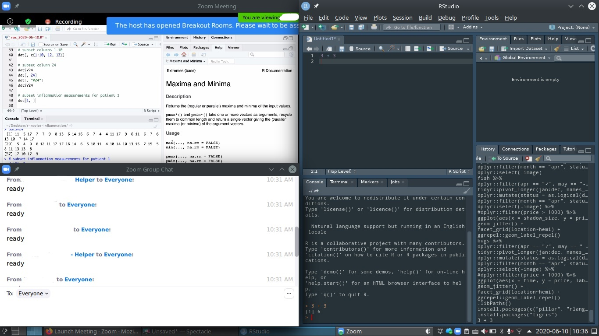

# Week 0: Setting up {-}

Before the first day of class, you'll need to set up a few things:  **R, RStudio, Slack, Zoom, and a GitHub account**.  I'd also like you to fill out a **pre-class survey**.  R is the primary piece of software we'll be learning to use.  RStudio is an IDE (integrated development environment) for using R.  (Think of R as the engine of a car and RStudio as the dashboard, steering wheel, and pedals.)  Slack will be the main way we communicate; we'll use Zoom for class time.  GitHub is a service for sharing and collaborating on software engineering projects.  

I'll assume you have R and RStudio installed using either *the cloud way* or *the Mac way*.  If your computer is running Windows, Linux, or some other operating system that isn't Mac OS, I'm going to assume you have things set up the cloud way. These other operating systems are perfectly fine.  But I don't use them, which makes it much harder for me to help you if things aren't working. And Windows handles things like file paths and text file formats in idiosyncratic ways that can cause weird errors.  

In either case, all of the software and services we'll be using are either free or freemium.  You won't need any of the paid extras for this course.  

## R and RStudio: The Mac Way ##

You can find some notes on accessibility and RStudio here:  <https://support.rstudio.com/hc/en-us/articles/360044226673-RStudio-Accessibility-Features>.  

With this way, R and RStudio are installed and run on your computer, and all of the data files that you work with will also be on your computer.  Unless you're running a Chromebook or similar, your computer is almost certainly more powerful than the default instance that RStudio Cloud gives you (see below), and you can use familiar tools to do things like organize folders and preview files.  But sometimes particular details about the way your computer is set up can cause R and RStudio to do weird things, and these problems can be very difficult to diagnose and solve.  

1. Go to <https://cran.r-project.org/>.  Download and install the latest release of R for your operating system (which should be Mac OS if you're following this way).  As of 2020-06-02, the latest release is 4.0.0.  

2. Go to [`rstudio.com`](https://rstudio.com/products/rstudio/download/#download).  Download and install the latest release of RStudio Desktop for your operating system (which should be Mac OS if you're following this way).  As of 2020-06-02, the latest release is 1.3.959.  

## R and RStudio: The Cloud Way ##

(**Note 2017-07-07** Starting in August, RStudio Cloud is moving out of beta and becoming a regular subscription service.  Information on pricing is at <https://rstudio.cloud/plans/free>.  We'll have to try it out, but it seems likely that the Free tier won't give you enough compute time ("project hours") for this course.  I can subscribe to the Instructor tier, but that has its own limitations.  We'll have to see how things go.) 

With this way, R and RStudio are installed and run on virtual computers (called *instances*) on a big server somewhere.  Each project can have its own instance, meaning that it runs on a nice clean computer and shouldn't have any weirdness.  The RStudio Cloud service is currently in beta; it's free to use, but not completely guaranteed to be free of bugs.  In order to use the service, you have to be connected to the internet, and you'll have to use the RStudio interface or a terminal window to do things like move files around.  Also, the instances aren't very powerful, and so they'll be slow if you try to work with large data sets or do a complex analysis.  

1. Go to [`rstudio.cloud`](https://rstudio.cloud/). Look for "Sign Up" in the upper right.[^google]

[^google]: RStudio gives you the option to log in with Google or GitHub.  As a general practice, I recommend always keeping your accounts separate.  Use a password manager to generate separate, strong passwords for each site.  I use [LastPass](https://www.lastpass.com/). 

## Slack ##

For Fall 2020, the class Slack channel is at <https://datascienceme-ke13588.slack.com>.  Please use your UC Merced email to sign up.  

If you use a screenreader, here are some notes on accessibility and Slack:  <https://www.marcozehe.de/status-of-the-accessibility-of-slack/>.  

## GitHub ##

1. Go to [`github.com`](https://github.com/). You can create a new account right on the front page.  I don't care what email address you use here.  

2. You can fill in your profile if you want.  

3. You'll send me the email address associated with your Github account in the pre-class survey.  

## Screen Layouts ##

In this course, a significant amount of time will be spent on *live coding*.  This means that I (or whoever's doing the lecturing) will be writing code in real time, and you'll follow along, transcribing the code into RStudio (or whatever) on your local machine and running it at the same time as me.  

Live coding is a great way to learn coding practices.  But it requires you to have quick access to 3-5 different things:  

* My screenshare (so you can see what I'm typing)
* The course Slack (so you can ask for help or other questions, or make comments)
* Possibly a separate way to put up a flag so that I can see immediately that you have a question
* Your own workspace (RStudio or whatever)
* Possibly a separate app for taking notes

In an ordinary classroom, the first three things would all be handled by the classroom environment.  In a fully online setting, everything needs to be handled on your computer.  

The most effective way to do this is to have multiple displays.  This is also the most expensive.  

[This blog post](https://carpentries.org/blog/2020/06/online-workshop-logistics-and_screen-layouts/) discusses alternatives to multiple displays.  In particular, the window layout below fits the screenshare, chat, and your workspace on to a single laptop display.  You can also have a separate text file open in RStudio for notes. You might consider having Slack open on your phone — so that you can keep an eye on the chat — as well in the background on your computer — so that you can alt-tab to it to actually type things.  

## Pre-Class Survey ##

Please take a few minutes to fill out this survey:  <https://ucmerced.az1.qualtrics.com/jfe/form/SV_eVU8JWREUu4UNH7>. 

## A Note on Accessibility ##

I chose the tools and platforms for this course in part because they're industry-standard.  If you pursue a career as a data scientist in industry, you'll be expected to use Slack and Github on a daily basis.  And RStudio is by far the most commonly used IDE ("integrated development environment") for R.  

However, like many other technologies, they were originally developed using ableist assumptions about "normal" computer users.  In response to criticism, the developers of these systems and tools have gone back and made their technologies more accessible.  But there may still be barriers to accessibility that I have not anticipated.  And of course the pandemic has created additional barriers, such as dependency on screensharing.  

If you encounter a barrier to participating in this course — even a small inconvenience — please let me know.  Similarly, if you have ideas for making the course more accessible, please share them with me.  
