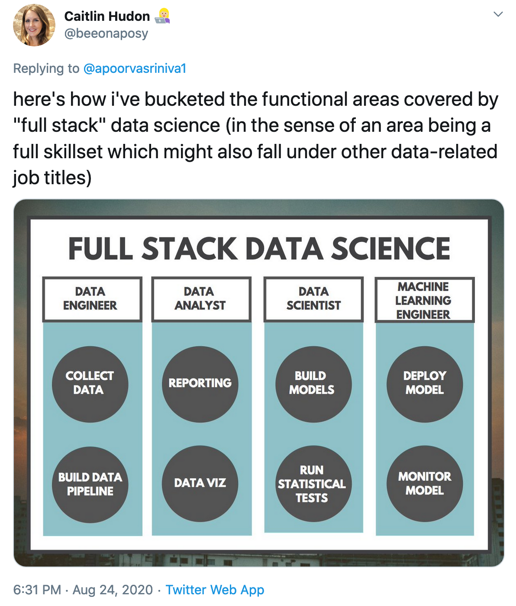

# What is this thing called data science? #

```{r child = 'knitr_config.Rmd'}
```

## Standard definition ##

(ref:ds-standard) Data science, defined as the intersection of CS, stats, and "business knowledge." Source: <https://www.kdnuggets.com/2020/08/top-10-lists-data-science.html>

```{r, echo=FALSE, fig.cap='(ref:ds-standard)'}
knitr::include_graphics('images/Abisiga.jpg')
```

- The intersection of computer science/software engineering, statistics, and "business knowledge"

Or, more concretely, 

(ref:boykis) Boykis Twitter poll of "data scientists"; 67% said they spend most of their time cleaning data/moving data. Source: <https://twitter.com/vboykis/status/1089920316644704256>

```{r, echo=FALSE, fig.cap='(ref:boykis)'}
knitr::include_graphics('images/Boykis.png')
```


(ref:scott) Scott tweet: "One of the biggest failures I see in junior ML/CV engineers is a complete lack of interest in building data sets. While it is boring grunt work I think there is so much to be learned in putting together a dataset. It is like half the problem." Source: <https://twitter.com/kscottz/status/1091423467772162049>

```{r, echo=FALSE, fig.cap='(ref:scott)'}
knitr::include_graphics('images/Scott.png')
```

(ref:hudon) Hudon tweet containing a graphic labelled "Full Stack Data Science," with categories "data engineer" (entries collect, build data pipeline), "data analyst" (entries reporting, data viz), "data scientist" (entries build models, run statistical tests), and "machine learning engineer" (entries deploy model, build model). Source: <https://twitter.com/beeonaposy/status/1298070348844457987>

```{r, echo=FALSE, fig.cap='(ref:hudon)'}

```

However,

- This focuses on *tools and techniques*, not the epistemic and practical *goals* of data science
    - An ecologist spends most of their time collecting specimens in the field and processing them in a lab, vs. 
    - An ecologist studies interactions among organisms and their environment

## A prior question: What is this thing called "data"? ##

- *Representational view*: Data are "reliable representations of reality which are produced via the interaction between humans and the world"
    - "The production of data is equivalent to 'capturing' features of the world that can be used for systematic study"
    - "Data [are seen as] as 'raw' products of research, which are as close as it gets to unmediated knowledge of reality"
    - Data provide "an objective foundation for the acquisition of knowledge" [@LeonelliScientificResearchBig2020]
    - **Data become data when they're produced according to a reliable, standardized measurement process**

- *Relational view*: "Data are objects that are treated as potential or actual evidence for scientific claims in ways that can, at least in principle, be scrutinised and accounted for"
    - "Any object can be used as a datum, or stop being used as such, depending on the circumstances"
    - **Data become data when they're used as evidence** [@LeonelliScientificResearchBig2020]
    - Note implications for ideas of "unmediated knowledge" and "objective foundation"
        
## Back to "data science" ##    

- Data science ≠ lab science (often)
    - Data collection isn't standardized
        - Found (or bought), not made
        - Data as byproduct
        - This is the point of the tweets above
        - ex: scraping from Twitter, Wikipedia, administrative records
    - Remixing and recombining data
        - ex: pesticide use + Census data in @HicksCensusDemographicsChlorpyrifos2020
    - Data first, questions later
    - **Relational view is often a better fit**

- The goal of data science is to **produce data**
    - To create, transform, and juxtapose objects such that they can be used as evidence
    - Can be done experimentally in a lab, but in other ways too
    
    
