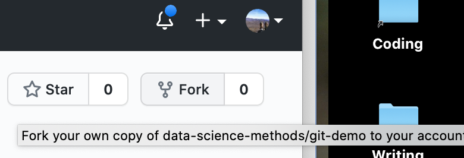

# Git and Version Control #

## Some motivating examples ##

- While working on your analysis code, you accidentally delete the first 35 lines of the script.  You only discover this three days later, when you restart R and try to run the script from the top.  Because of the time you last half of your senior thesis, you've been saving every couple of minutes.  
- You're working on a paper with two coauthors.  You prepare the final draft to send for submission: `paper final.docx`.  But one of your coauthors discovers a typo.  Now it's `paper final fixed typo.docx`.  Another realizes six references are missing.  `paper final fixed typo refs.docx`.  That's getting confusing so you change it to `paper 2 Aug 2021.docx`.  Once it comes back from review you need to make revisions.  Now you have `paper 30 Jan 2022.docx` and, after your collaborators make their changes, `paper 12 February 2022 DJH.docx` and `paper 12 February 20222 final.docx`. 
- You have a complicated analysis spread over several scripts.  You want to explore a variant analysis, but doing so will involve changes in 15 different places across 3 different files.  You're not sure if this variant analysis will work; you may or may not want to keep it.  

## Version control ##

- Basic idea: Tools for tracking and reversing changes to code over time
- Useful for identifying and reversing breaking changes
- Implementations upload to cloud, track who contributes code, control who can suggest vs. actually change code
- Good for collaboration, publishing code
    
- git
    - One of many version control systems
    - Very popular in part thanks to GitHub, which provides free hosting for open-source projects
    
## How to do things with git ##

- Interfaces
    - Command line
    - RStudio projects
    - GUIs: [GitHub](https://desktop.github.com/), [Sourcetree](https://www.sourcetreeapp.com/)
- Setup
    - [Installation](https://git-scm.com/book/en/v2/Getting-Started-Installing-Git)
    - User config
```
$ git config --global user.name "Maria Hernandez"
$ git config --global user.email mhernandez123@ucmerced.edu
```

- `git init`
    - Create a folder called `test` and open a terminal window there.  
```
$ git status
$ git init
$ git status
```

- `add` and `commit` a file
Create a text file and save it as `readme.txt` in `test`.  
```
$ git status
$ git add test.txt
$ git status
$ git commit -m "my first commit"
$ git status
```

- `.gitignore`
    - Create a subfolder `images` and put an image file of some kind in it. 
    - Create a text file `.gitignore` in `test`.  Put the following line in: 
```
images
```
    - Add another image file.  Edit `.gitignore` so that it ignores the first image file but not the second.  
    - Track `.gitignore`

## Working with GitHub remotes ##

- *remote*: A copy of a repository that lives on a server somewhere else

### Working with *your own* repos ###

- On GitHub, click "New" and walk through the steps to create a new repository.  Let's call it `mytest`. 
- Copy the URL: `https://github.com/username/mytest`
- Back in the Terminal window: 

```
$ git remote add origin https://github.com/username/mytest
```

You'll need to authenticate with your GitHub password. If you forget the exact incantation, try `git push`; it will give you a helpful example.  

- `push` and then refresh GitHub in your browser

```
$ git push
```

- Edit the repository (eg, use the prompt near the bottom to create a readme).  Then: 

```
$ git fetch  ## Downloads a comparison, but doesn't change your local files yet
$ git status
$ git pull   ## Changes your local files
$ git status
```

### Working with *someone else's* repos ###

GitHub lets you download someone else's repo ("clone"), and modify it locally, but *not* upload directly.  You can suggest a change to someone else's code by submitting a *pull request*, which requires *forking* the repository.  

```{r, echo=FALSE, fig.cap="*Forking* copies a repository to your GitHub account.  Then you *clone* the copy to your local machine.  You can *push* to your remote copy as usual.  You can suggest changes to the original using a *pull request*.  Source: <https://happygitwithr.com/fork-and-clone.html>"}
knitr::include_graphics('images/fork-and-clone.png')
```

- A demonstration repository: <https://github.com/data-science-methods/git-demo>
- *Fork step*: Look for the `fork` button in the upper-right

```{r, echo=FALSE, fig.cap="The *fork* button is near the upper-right corner of a GitHub repository page.  I wasn't able to find a keyboard shortcut for this.  :-("}

```

- *Clone step*: After creating the fork, you need to download a copy to your machine. Open a Terminal window to the folder *right above* where you want the repository folder to be located, eg, `projects`. 

```
$ git clone https://github.com/YourUsername/git-demo
$ cd git-demo
$ git status
```

- *Push step*: Make changes locally, then push them back up to *your* GitHub copy of the repo

- *Pull request*: *[todo]*

## Moar git stuff ##
*[todo]*
- browsing history on GitHub
- stretch goals: `branch`; `checkout`
