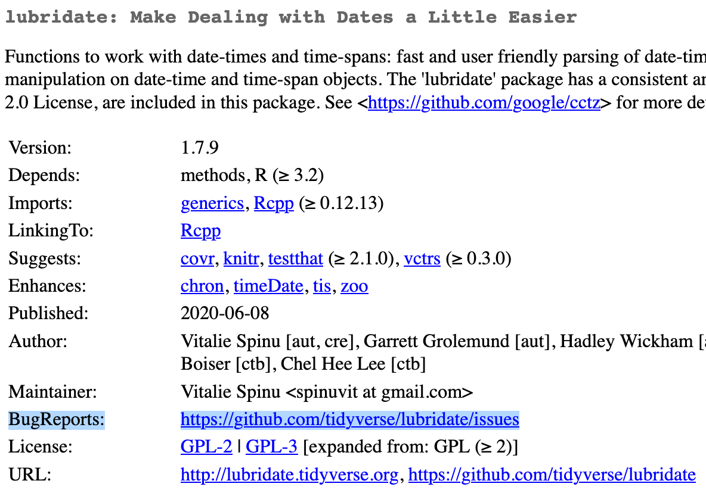
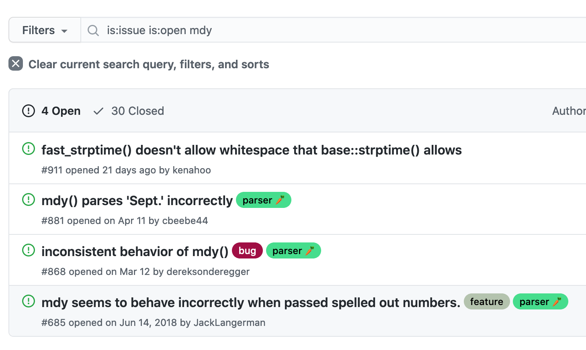

# Warnings, Errors, and Getting Help #

```{r child = 'knitr_config.Rmd'}
```

## Recommended reading and watching

- <https://stackoverflow.com/a/5963610/3187973>
    - <https://github.com/jennybc/debugging#video>


## Messages, warnings, and errors

- *Message*:  Things are fine, but here's some information you should know
- *Warning*:  Uhhhh I'm gonna keep going, but maybe this isn't what you want
- *Error*:  Nope.  I'm stopping here.  You need to fix the thing. 

## Where to go for help

- Isolate the problem
- Restart your session: Session $\to$ Restart R
- Local help: `?fun`
- StackOverflow: <https://stackoverflow.com/questions/tagged/r>
    - CRAN $\to$ BugReports (usually GitHub Issues)

```{r, eval=FALSE}
library(lubridate)

some_data = c('June 2002', 'May 15, 2007', 'August 2007')
mdy(some_data)
parse_date_time(some_data, orders = 'mdY')
```

Let's try SO: <https://stackoverflow.com/search?q=%5BR%5D+lubridate+month-year>
```{r, eval=FALSE}
parse_date_time(some_data, orders = c('mY', 'mdY'))
```

Here's another one:  
    ```{r, eval=FALSE}
more_data = c('May 7, 2017', 'May 19, 2017', 'May Fifth, 2017')
mdy(more_data)
```

SO doesn't seem so helpful: <https://stackoverflow.com/search?q=%5BR%5D+lubridate+written+days>

Let's check the CRAN page for `lubridate`: <https://cran.r-project.org/web/packages/lubridate/index.html>

```{r, echo=FALSE, fig.cap='Screenshot of `lubridate` on CRAN, highlighting the BugReports field'}

```

Trying a couple of searches gives us a promising result: <https://github.com/tidyverse/lubridate/issues?q=is%3Aissue+is%3Aopen+mdy>
    
```{r, echo=FALSE, fig.cap='Screenshot of `lubridate` issues page, showing a relevant search result'}

```

This is a known bug; it looks like they're thinking about doing something about it, but the only workaround is to create an NA:  <https://github.com/tidyverse/lubridate/issues/685>

## Writing a reproducible example: `reprex`

- <https://reprex.tidyverse.org/>
- <https://reprex.tidyverse.org/articles/articles/learn-reprex.html>
- <https://reprex.tidyverse.org/articles/reprex-dos-and-donts.html>

## Do not do these things in your reprex

If you do them, [Jenny Bryan will come to your office and set your computer on fire](https://www.tidyverse.org/blog/2017/12/workflow-vs-script/). 

- `setwd('/users/danhicks/projects/catsaregreat/myscript/')`
    - Used to ensure that R is running where your file is
    - Unnecessary if you're opening different projects in different RStudio sessions
    - Will cause irrelevant errors on any other system
    - Aside:  use `file.path()` or `here::here()` to build paths
    
- `rm(list=ls())`
    - Used because people think it clears out the global environment
    - Unnecessary if you're regularly using Session $\to$ Restart R
    - Also unnecessary at the top of a `Rmd` file, which is always knit in a new session
    - Doesn't actually clear out the global environment
        - eg, doesn't unload packages or reset `options()`
        
Not on Bryan's list, but a bonus thing to not do: 

- `require(package)`
    - If `package` is installed, will act just like `library()`
    - If not, will return `FALSE`
        - which generally means the script will keep going until you get some kind of error about a missing function sometime later
        - probably not the error you wanted help with
        - annoying to debug because I have no idea where the function is supposed to come from
    - If `library()` can't find the package, it immediately raises an error
        - I can tell right away what package needs to be installed
