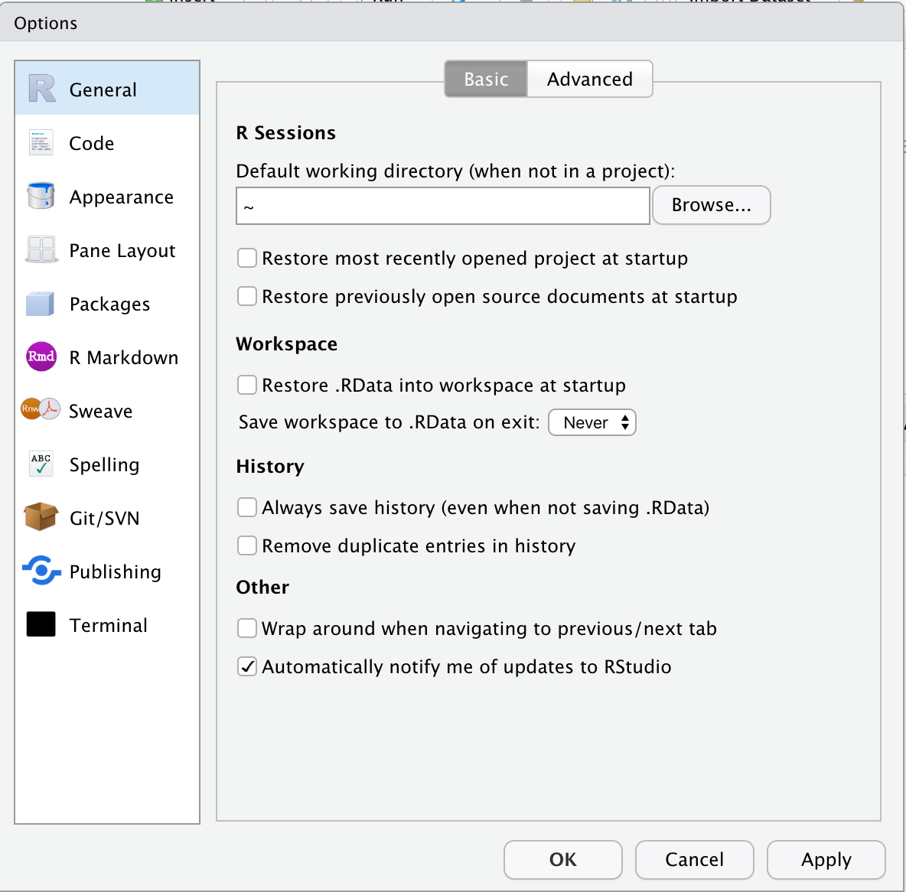

---
output:
  pdf_document: default
  html_document: default
---
# (PART) Some fundamental tools {-}

# R Basics #

## Let's get started with RStudio ##

* Quick tour of RStudio's UI
* Let's plot a thing (below)
* Some idiosyncracies of my code
    - `'` rather than `"`
    - `##` for documentation comment
    - `=` not `<-` for assignment

* Essential Global Options
    - Never save .Rdata, load workspace
    - { width=50% }
* Super useful keyboard commands: 
    - Insert a pipe: ⌘+Shift+m
    - Comment/uncomment: ⌘+Shift+c
    - Tools $\to$ Modify Keyboard Shortcuts...
        - ⌘+1, ⌘+2, ⌘+3
    - Cheatsheet: <https://raw.githubusercontent.com/rstudio/cheatsheets/master/rstudio-ide.pdf>

```{r, eval=FALSE}
data(anscombe) ## <https://en.wikipedia.org/wiki/Anscombe%27s_quartet>

anscombe
str(anscombe)
summary(anscombe)

library(ggplot2)
ggplot(data = anscombe, aes(x = x1, y = y1)) +
    geom_point()
```

### Exercise ### 
Plot the other three datasets

* Selecting variables, `mean`, `sd`, and correlation

```{r, eval=FALSE}
anscombe$x1
anscombe[['x1']]

anscombe[,'x1']
anscombe[,1]

mean(anscombe$x1)
mean(anscombe$x2)

sd(anscombe$y1)
sd(anscombe$y2)

cor(anscombe$x1, anscombe$y1)
```

### Exercise ### 

Calculate correlations for all four x-y pairs

## Base R data types ##

### Numerics
```{r, eval=FALSE}
foo = 2
bar = 3
foobar = foo + bar
foo / bar
try(foo / 0)
```

### Vectors
```{r, eval=FALSE}
foo = c(2, 3, 4)
bar = c(5, 6, 7)
foo[2]
foo[2:3]
try(foo[1, 3])
foo[c(1, 3)]

foo + bar
foo * bar
## NB difference between vector and length-1 comparisons
bar == foo + 3
identical(bar, foo + 3)

c(foo, bar)
```

### Strings
```{r, eval=FALSE}
foo = c('monkey', 'banana')
bar = c('house')
## How to put these together? 
try(foo + bar)
c(foo, bar)
paste(foo, bar)
paste0(foo, bar)
```

### Factors
```{r, eval=FALSE}
foo_str = c('foo', 'foo', 'bar', 'zoo')
as.integer(foo_str)
foo_fct = as.factor(foo_str)
as.integer(foo)
levels(foo_fct)
```

### Lists 
*[todo]*

### Data frames
*[todo]*


## *[examining variables]*
- length
- str
- class, typeof
- [challenge](https://gge-ucd.github.io/R-DAVIS/lesson_how_r_thinks_about_data.html#challenge)

## *[Missing data]*

<https://gge-ucd.github.io/R-DAVIS/lesson_how_r_thinks_about_data.html#missing_data>


# Git and Version Control #

- *[motivating example]*

- Version control
    - Basic idea: Tools for tracking changes to code over time
    - Useful for identifying and reversing breaking changes
    - Implementations upload to cloud, track who contributes code
    - Good for collaboration, publishing code
    
- git
    - One of many version control systems
    - Very popular in part thanks to GitHub, which provides free hosting for open-source projects
    
- git interfaces
    - command line
    - RStudio projects
    - GUIs: GitHub, Sourcetree
    
- How to do things with git
    - setup
        - installation
        - user config
    - `git init`
    - `add`
    - `commit`
    - `.gitignore`
    - `fetch` and `pull`
    - `push`
    - forking
    - pull requests
    - browsing history on GitHub
    - stretch goals: `branch`; `checkout`


# Functional Programming and Data Science #

- Recommended reading:  @ChambersObjectOrientedProgrammingFunctional2014; parts II and III of @WickhamAdvanced2014

- Programming paradigms
    - *Procedural*:  Software is a series of instructions ("procedures"), which the computer carries out in order.  Special instructions (if-then, loops) are used to change the order based on inputs or other conditions.  

    - *Object-oriented*:  Software is made up of objects, which have properties ("attributes," including other objects) and do things ("methods").  
        - Example: A board game consists of 1 or more players, a board, and a deck of cards.  
            - Players each have a hand of cards (attribute), can draw cards from the deck into their hand (method, which also changes the deck's attributes), and can play cards to manipulate tokens on the board (method, which also changes the board's attributes).  
            - The game itself is an object, with the players, board, and deck for its attributes and methods to things up, run turns in sequence, determine the winner.  
            - Separate objects might be responsible for displaying the current state of the game and getting input from the users.  
        - Much better than procedural paradigms for *encapsulation*: When a player draws a card from the deck, we just need to know the inputs and outputs for `Deck.draw()`, not the details of how the deck tracks the order of cards and which ones have already been drawn. 
        - Much easier to reason about systems with lots of dynamic, interacting parts.  
        - Examples (mostly): Python, C++, Java
    
    - *Functional*: Software is made up of functions, which are run sequentially on the inputs
        - Example: Raw data are read in, cleaned, and then a regression model is fit.  The model coefficients are tested for statistical significance, and a table and plot are written out to disk.  
        - **Data analysis as a building series of pipes**
        - Examples (mostly): R, Lisp, Haskell
    
    - A couple of extra rules for functional programming
        - *Immutability*:  Once the value is assigned to a variable, that value cannot be changed
        - *No side effects*:  Functions don't change anything outside of themselves; they only return a value


# Warnings, Errors, and Getting Help #

## Recommended reading and watching

- <https://stackoverflow.com/a/5963610/3187973>
- <https://github.com/jennybc/debugging#video>


## Messages, warnings, and errors

- *Message*:  Things are fine, but here's some information you should know
- *Warning*:  Uhhhh I'm gonna keep going, but maybe this isn't what you want
- *Error*:  Nope.  I'm stopping here.  You need to fix the thing. 

## Where to go for help

- Isolate the problem
- Restart your session: Session $\to$ Restart R
- Local help: `?fun`
- StackOverflow: <https://stackoverflow.com/questions/tagged/r>
- CRAN $\to$ BugReports (usually GitHub Issues)
    
```{r, eval=FALSE}
library(lubridate)

some_data = c('June 2002', 'May 15, 2007', 'August 2007')
mdy(some_data)
parse_date_time(some_data, orders = 'mdY')
```

Let's try SO: <https://stackoverflow.com/search?q=%5BR%5D+lubridate+month-year>
```{r, eval=FALSE}
parse_date_time(some_data, orders = c('mY', 'mdY'))
```

Here's another one:  
```{r, eval=FALSE}
more_data = c('May 7, 2017', 'May 19, 2017', 'May Fifth, 2017')
mdy(more_data)
```

SO doesn't seem so helpful: <https://stackoverflow.com/search?q=%5BR%5D+lubridate+written+days>

Let's check the CRAN page for `lubridate`: <https://cran.r-project.org/web/packages/lubridate/index.html>

{ width=50% }

Trying a couple of searches gives us a promising result: <https://github.com/tidyverse/lubridate/issues?q=is%3Aissue+is%3Aopen+mdy>

{ width=50% }

This is a known bug; it looks like they're thinking about doing something about it, but the only workaround is to create an NA:  <https://github.com/tidyverse/lubridate/issues/685>

## Writing a reproducible example: `reprex`

- <https://reprex.tidyverse.org/>
- <https://reprex.tidyverse.org/articles/articles/learn-reprex.html>
- <https://reprex.tidyverse.org/articles/reprex-dos-and-donts.html>


