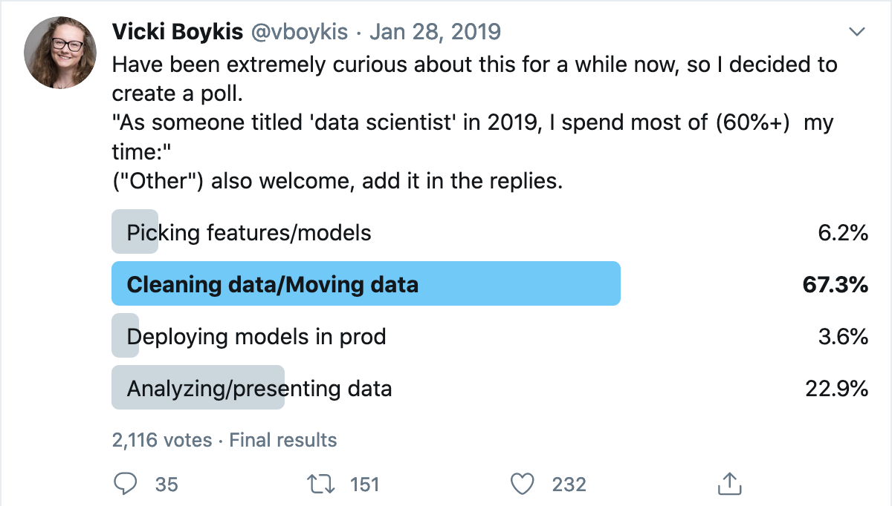
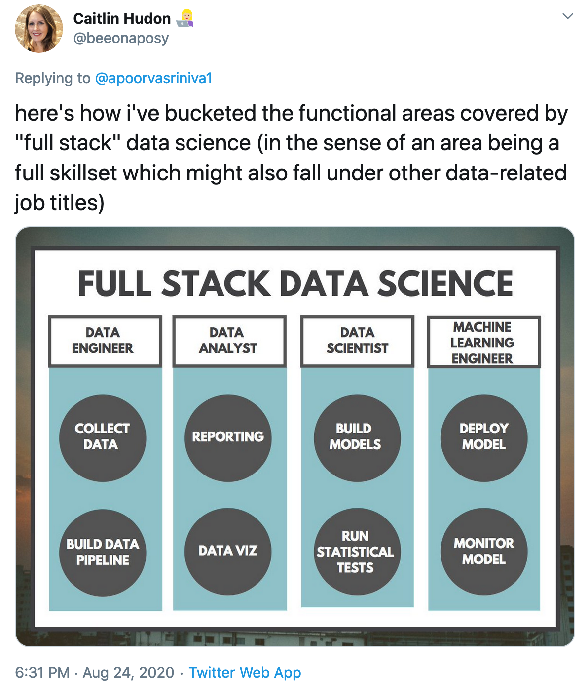

--- 
title: "Methods of Data Science I"
author: "Dan Hicks, <hicks.daniel.j@gmail.com>"
github-repo: data-science-methods/book
date: "`r date()`"
site: bookdown::bookdown_site
# documentclass: book
bibliography: [book.bib, packages.bib]
link-citations: yes
description: "This document is a set of notes (and perhaps later a textbook) for a course on data science methods for graduate students in social and behavioral sciences."
---

```{r child = 'knitr_config.Rmd'}
```


# Preface # {-} 

This document is a set of notes (and perhaps later a textbook) for a course on data science methods for graduate students in social and behavioral sciences, taught by Professor Dan Hicks (they/them), UC Merced. 

The course site is available [here](..). 

<!-- PDF versions of each chapter can be found here:  [Handouts](handouts/index.html) -->

<!-- (The URLs to the handouts are buggy.  To get to them, look for `handout/handout/` in the URL; delete the second `handout/`.) -->

-----

These notes were written in [RStudio](http://www.rstudio.com/ide/) using [bookdown](http://bookdown.org/). The complete source is available on [GitHub](https://github.com/data-science-methods/book/) and is automatically rebuilt using GitHub actions. 

This version of the book was built with `r R.version.string`, [pandoc](https://pandoc.org/) version `r rmarkdown::pandoc_version()`, and the following packages:


```{r pkg-list, echo = FALSE, results="asis"}
## From <https://github.com/tidymodels/TMwR/blob/master/index.Rmd>
deps <- desc::desc_get_deps()
pkgs <- sort(deps$package[deps$type == "Imports"])
pkgs <- sessioninfo::package_info(pkgs, dependencies = FALSE)
df <- tibble::tibble(
  package = pkgs$package,
  version = pkgs$ondiskversion,
  source = gsub("@", "\\\\@", pkgs$source)
)
knitr::kable(df, format = "markdown")
```

<!--chapter:end:index.Rmd-->

<!--
# Notes for changes for next year #

- require basic familiarity with R; offer workshop or pre-semester session on R basics
- explicit expectation that lab discussion questions are answered on Slack
- git probably needs notes on resolving conflicts, if only for getting students unstuck
- do cover getting help w/ R in class

- open wtf data science by asking students for their preconceptions about data science

- make Ames housing data 2-part lab: 1. part inspecting variables, 2. part visual

- more callbacks to previous material

- walk through testing infrastructure and how to read feedback

- moral aspects of open science/open data
    - move data management horror stories to data management notes
    
- <https://thepsychologist.bps.org.uk/volume-33/november-2020/bropenscience-broken-science>

- replace make with snakemake? <https://lachlandeer.github.io/snakemake-econ-r-tutorial/>

- StoudtPrinciplesDataAnalysis2020 to structure course?  as early reading? 

- data quality case study: <https://www.sacbee.com/news/california/article250981409.html>

- reproducibility (and project organization) project: <https://github.com/paolocrosetto/MDPI_special_issues>

- BezuidenhoutWhatDoesIt2020

- reproducibility identified as most difficult (too quick; difficult w/ limited experience w/ R; lots of moving parts)

- COMPAS section didn't feel integrated w/ rest of course, assignment wasn't relevant to academic careers

- want more EDA, better integration of final project, more paired coding

- liked the labs

- want more live coding, less seminar

- missing data case study: <https://www.nature.com/articles/s41586-021-03655-4>

- reading other peoples' code: <https://masalmon.eu/2021/07/13/code-detective/>

- Rodriguez-LonebearBuildingDataRevolution2016

- OBrienBeingScientistMeans1993

- Healey's covdata appears to have been suspended at the same time as the Covid Tracking project
    - CDC doesn't appear to have daily county-level data? 
    - Hopkins does:  <https://github.com/CSSEGISandData/COVID-19/tree/master/csse_covid_19_data/csse_covid_19_time_series>
    - CDC county-level vaccination data: <https://data.cdc.gov/Vaccinations/COVID-19-Vaccinations-in-the-United-States-County/8xkx-amqh>
    - WSJ story on vaccines vs. cases: <https://www.wsj.com/articles/highly-vaccinated-states-keep-worst-covid-19-outcomes-in-check-as-delta-spreads-wsj-analysis-shows-11628328602>

-->

<!--chapter:end:00-00-notes.Rmd-->

# Introduction #

## Land acknowledgements ##

### [Campus land acknowledgment](https://diversity.ucmerced.edu/values/land-acknowledgement) ###

We pause to acknowledge all local indigenous peoples, including the Yokuts and Miwuk, who inhabited this land. We embrace their continued connection to this region and thank them for allowing us to live, work, learn, and collaborate on their traditional homeland. Let us now take a moment of silence to pay respect to their elders and to all Yokuts and Miwuk people, past and present.

### Instructor's land acknowledgment ###

UC Merced and the City of Merced are on the traditional territory of the Yokut people.  This land was stolen by Spanish, Mexican, and American settlers through acts of slavery and genocide.  In addition, UC Merced is strongly associated with Ahwahne, known as Yosemite Valley.  This valley was the traditional home of the Ahwahnechee people, who were the victims of some especially horrific, state-sponsored genocidal acts.  For more on the history of Ahwahne, see <https://tinyurl.com/y879jw8s>.  For more information on land acknowledgments, see <https://native-land.ca>.  


## About the instructor ##

Dan Hicks is a philosopher turned data scientist turned philosopher.  

I use they/them pronouns and identify as nonbinary.  I grew up in Placerville, about two hours north of Merced in the Sierra Foothills.  One branch of my family came to California during the Gold Rush, so I identify heavily as a Californian and have some complicated feelings about the genocide.  I finished my PhD in philosophy of science at Notre Dame in 2012.  After that I worked in a series of research positions in academia and the federal government.  During 2015-2019 I was using data science methods at least half-time.  I joined the faculty at UC Merced in Fall 2019.  

- Email: <dhicks4@ucmerced.edu>
- Student hours: By appointment: <https://doodle.com/mm/danhicks/office-hours>
- Website: <https://dhicks.github.io/>


## What this course isn't, and is ##

Is Not: 

- a statistics course (in the way you think)
- a general introduction to software engineering
- a basic introduction to R
- carefully planned out from beginning to end

Is: 

- an introduction to data science
- about exploratory data analysis, data management, and reproducibility
- habituation to some good software engineering practices that are especially valuable for data science work
- in the [alpha stage of development](https://en.wikipedia.org/wiki/Software_release_life_cycle#Alpha)


## Learning outcomes ##

*[match to catalog]*

By the end of the course, students will be able to 

1. apply concepts from software engineering and philosophy of science to methodological decisions in data science, including
	- reproducibility vs. robustness vs. replicability
	- value and hazards of open data
	- thick data [@WangWhyBigData2016]

3. use exploratory data analysis techniques and tools to identify potential data errors and potential phenomena for further analysis

2. clean raw data and produce a reproducible codebook for both downstream analysis and public release of data according to FAIR standards [@WilkinsonFAIRGuidingPrinciples2016]
	- [create and use a cloud database to work with big data]

4. manage data, analysis, and outputs for reproducibility [assembling a project compendium; @GentlemanStatisticalAnalysesReproducible2004] using best practices of data handling, a clear directory structure [@WilsonGoodEnoughPractices2017], self-documenting code, version control, build automation, [and continuous integration] 

5. apply philosophical and data science concepts to integrated ethical-technical analysis to case studies in algorithmic injustice
    - understand the background on the COMPAS case:  @AngwinMachineBiasThere2016; @Corbett-DaviesComputerProgramUsed2016
	- reproduce several fairness statistics on COMPAS data
	- explain tradeoffs between false negatives and false positives in terms of inductive risk
	- explain @KleinbergInherentTradeOffsFair2016 impossibility result (not necessarily the proof) and show that it applies to the COMPAS datas
	- critically discuss profiling and thresholds [@PiersonLargescaleAnalysisRacial2020] as potential explanation for differences in "base rates" of recidivism
	- critically locate discussions of fairness and recidivism in a broader social context, and identify implications for working data scientists [@SelbstFairnessAbstractionSociotechnical2018; @HoffmannWhereFairnessFails2019; @HannaCriticalRaceMethodology2019]


## Prerequisites ##

*This course assumes basic competence with introductory R.* 

- "Introductory R":  Lessons 1-5 of the Carpentries ["R for Social Scientists"](https://datacarpentry.org/r-socialsci/) curriculum
    - Installing R and packages
    - Working in the R Studio IDE
    - Common data types
    - Reading and writing CSV files
    - Tidyverse R:  `mutate()`, `filter()`, `select()`; plotting with `ggplot2`
- "Basic competence":  Given time and a reference ([cheatsheet](https://www.rstudio.com/resources/cheatsheets/), Stack Exchange, mentor) you can figure out how to solve a problem


## Requirements and weekly routine ##

*This is aspirational.*

- Tuesdays:  Mix of discussion and lecture based on assigned readings
- Thursdays:  Live coding leading into work on the week's lab assignment
- Labs:  10-ish, done individually or in pairs and submitted via GitHub for automated feedback
- Running project:  Practicing ideas from the course on data sets you find


<!--
## Notes on some course design decisions ##

### R, not Python ###

- Python is a perfectly good language for general programming
    - And has some advantages over R in certain data science aspects, including working with strings and developing custom data structures

However, 

- R is a better language for doing data science [@ShotwellWhyUse2019]
    - Vectors, data frames, and common statistical models are installed and loaded by default
    - R is more functional [@WuPythonVsChoosing2019; @PaleologoWhatDifferenceMachine2018]
    
- R is also better for beginners
    - [CRAN](https://twitter.com/kccarrell/status/1030482372775620613)
    - RStudio
    
### Tidyverse R, not base R ###

- "Base R" refers to the central code for R and the packages included when you install it
    - Base R is universal and free of additional dependencies.  Code written entirely in base R will run on any other R installation (with the same version). 
    - However, because the R Core Development Team has always thought backwards-compatibility is important, base R has some idiosyncracies [@KeyesRbitraryStandards2016]
    
- `tidyverse` is a suite of packages developed by the manufacturers of RStudio
    - A very useful set of general tools can be loaded simply by calling `library(tidyverse)`
        - And some more specialized tools are also installed as part of the suite
    - Tidyverse is designed to mitigate a lot of the base R idiosyncracies
    - While making code more human-readable and easier to reason about
    - However, several of its tools use something called "non-standard evaluation" (NSE). 
        - NSE makes tidyverse code easier to write for beginners, because you don't have to think as much about where exactly your variables are located
        - At the same time, NSE creates problems for intermediate coders, because passing tidyverse-style "bare names" through function arguments causes cryptic errors

### Scripts, not notebooks ###

- Quite a few scientists like the way notebooks mix together code, visualizations, tables, and text [@PerkelWhyJupyterData2018]

However, 

- Notebooks do not play nicely with version control  [@AhemadVersionControlJupyter2018; @WhitmoreJupyterNotebookBest2015]
- Notebooks encourage bad software engineering habits and discourage good ones [@GrusDonNotebooksJoel; @HiltchJupyterNotebookCancer2019]
-->

<!--chapter:end:01-01-intro.Rmd-->

# Software, hardware, and accounts #

- [R](https://cran.r-project.org/) and [RStudio](https://rstudio.com/products/rstudio/download/):  
    - Last year R had a major release (version 4)
    - Addressing some bugs has led to some rapid development in R and RStudio
    - For consistency in class, **I encourage you to use the latest version of both R and RStudio**
    - [Help on switching between different versions of R](https://support.rstudio.com/hc/en-us/articles/200486138-Changing-R-versions-for-the-RStudio-Desktop-IDE)
    - As of 2021-07-29, the machines in our classroom have R 4.0.2 and RStudio 1.3.1056
    
- OS:  
    - All of the tools we'll use are available on all major OSes
        - (Except Sourcetree, which isn't essential.  [List of git GUIs](https://git-scm.com/download/gui/linux))
    - I have much less experience debugging Windows and Linux, but will do what I can
    
- You'll need a [GitHub](https://github.com/) account and [Sourcetree](https://www.sourcetreeapp.com/)
    - GitHub is [owned by Microsoft](https://www.cnbc.com/2020/11/29/microsofts-github-has-become-magnet-for-thorny-issues-like-riaa.html)
    - And there are [concerns about how it mined public repositories to develop a code completion tool](https://www.theverge.com/2021/7/7/22561180/github-copilot-legal-copyright-fair-use-public-code)
    - But it offers some key features that I want to use in this course
    - You can do everything this course requires in private repositories, so long as you give access to the people who need access

- I strongly recommend *against* tablets (iPad, Surface) for this course
    - Unless you're using a cloud service such as RStudio Cloud

- I recommend that your machine have at least
    - 200 GB free hard drive space
    - 8 GB RAM
    - Intel i5 processor
    - Operating system capable of running the most recent release of R (4.1.0 as of 2021-07-28)
        - Mac: 10.13 (High Sierra) or more recent
        - Windows: See [here](https://cran.r-project.org/bin/windows/base/rw-FAQ.html#Does-R-run-under-Windows-Vista_003f)
        - If you're running Linux I'm going to assume you can figure this out yourself
        
- Using the computer lab machines
    - The machines are just a little behind the most recent versions of R and RStudio
    - But should work fine for our purposes
    - I recommend carrying your work on a flash drive

## A Note on Accessibility ##

I chose the tools and platforms for this course in part because they're industry-standard.  If you pursue a career as a data scientist in industry, you'll be expected to use GitHub (or something similar) on a daily basis.  And RStudio is by far the most commonly used IDE ("integrated development environment") for R. 

However, like many other technologies, they were originally developed using ableist assumptions about "normal" computer users.  In response to criticism, the developers of these systems and tools have gone back and made their technologies more accessible.  But there may still be barriers to accessibility that I have not anticipated.  

If you encounter a barrier to participating in this course — even a small inconvenience — please let me know.  Similarly, if you have ideas for making the course more accessible, please share them with me.  


<!--chapter:end:01-02-setup.Rmd-->

# Data Science: What and why #

```{r child = 'knitr_config.Rmd'}
```

## Reading ##

- @WilsonGoodEnoughPractices2017
- @McElreathScienceAmateurSoftware2020

## Discussion question ##

*Why did you decide to take a class called "data science"?*  

## Standard definition ##

(ref:ds-standard) Data science, defined as the intersection of CS, stats, and "business knowledge." Source: <https://www.kdnuggets.com/2020/08/top-10-lists-data-science.html>

```{r, echo=FALSE, fig.cap='(ref:ds-standard)'}
knitr::include_graphics('images/Abisiga.jpg')
```

- The intersection of computer science/software engineering, statistics, and "business knowledge"

- But this defines data science in terms of *tools and techniques*, not epistemic and practical *goals*.  Compare: 
    - An ecologist is someone who spends most of their time collecting specimens in the field and processing them in a lab, vs. 
    - An ecologist is someone who studies interactions among organisms and their environment
    
## Discussion question ## 

*What are the epistemic and practical goals of your scientific field?  How do you think "data science" will be useful for pursuing those goals?*


<!--
## What is this thing called "data"? ##

(ref:boykis) Boykis Twitter poll of "data scientists"; 67% said they spend most of their time cleaning data/moving data. Source: <https://twitter.com/vboykis/status/1089920316644704256>

```{r, echo=FALSE, fig.cap='(ref:boykis)'}

```


(ref:scott) Scott tweet: "One of the biggest failures I see in junior ML/CV engineers is a complete lack of interest in building data sets. While it is boring grunt work I think there is so much to be learned in putting together a dataset. It is like half the problem." Source: <https://twitter.com/kscottz/status/1091423467772162049>

```{r, echo=FALSE, fig.cap='(ref:scott)'}
knitr::include_graphics('images/Scott.png')
```

(ref:hudon) Hudon tweet containing a graphic labelled "Full Stack Data Science," with categories "data engineer" (entries collect, build data pipeline), "data analyst" (entries reporting, data viz), "data scientist" (entries build models, run statistical tests), and "machine learning engineer" (entries deploy model, build model). Source: <https://twitter.com/beeonaposy/status/1298070348844457987>

```{r, echo=FALSE, fig.cap='(ref:hudon)'}

```


- *Representational view*: Data are "reliable representations of reality which are produced via the interaction between humans and the world"
    - "The production of data is equivalent to 'capturing' features of the world that can be used for systematic study"
    - "Data [are seen as] as 'raw' products of research, which are as close as it gets to unmediated knowledge of reality"
    - Data provide "an objective foundation for the acquisition of knowledge" [@LeonelliScientificResearchBig2020]
    - **Data become data when they're produced according to a reliable, standardized measurement process**

- *Relational view*: "Data are objects that are treated as potential or actual evidence for scientific claims in ways that can, at least in principle, be scrutinised and accounted for"
    - "Any object can be used as a datum, or stop being used as such, depending on the circumstances"
    - **Data become data when they're used as evidence** [@LeonelliScientificResearchBig2020]
    - Note implications for ideas of "unmediated knowledge" and "objective foundation"
        
## Back to "data science" ##    

- Data science ≠ lab science (often)
    - Data collection isn't standardized
        - Found (or bought), not made
        - Data as byproduct
        - This is the point of the tweets above
        - ex: scraping from Twitter, Wikipedia, administrative records
    - Remixing and recombining data
        - ex: pesticide use + Census data in @HicksCensusDemographicsChlorpyrifos2020
    - Data first, questions later
    - **Relational view is often a better fit**

- The goal of data science is to **produce data**
    - To create, transform, and juxtapose objects such that they can be used as evidence
    - Can be done experimentally in a lab, but in other ways too
-->
    

<!--chapter:end:01-03-data-sci-wtf.Rmd-->

# (PART) Some fundamental tools {-}

<!--chapter:end:02-01-some-fundamental-tools.Rmd-->

# Git and Version Control #

```{r child = 'knitr_config.Rmd'}
```

## Some motivating examples ##

- While working on your analysis code, you accidentally delete the first 35 lines of the script.  You only discover this three days later, when you restart R and try to run the script from the top.  Because you lost half of your senior thesis in undergrad, you hit Control+S to save every couple of minutes.  
- You're working on a paper with two coauthors.  You prepare the final draft to send for submission: `paper final.docx`.  But one of your coauthors discovers a typo.  Now it's `paper final fixed typo.docx`.  Another realizes six references are missing.  `paper final fixed typo refs.docx`.  That's getting confusing so you change it to `paper 2 Aug 2021.docx`.  Once it comes back from review you need to make revisions.  Now you have `paper 30 Jan 2022.docx` and, after your collaborators make their changes, `paper 12 February 2022 DJH.docx` and `paper 12 February 20222 final.docx`. 
- You have a complicated analysis spread over several scripts.  You want to explore a variant analysis, but doing so will involve changes in 15 different places across 3 different files.  You're not sure if this variant analysis will work; you may or may not want to keep it.  

## Version control ##

- Basic idea: Tools for tracking and reversing changes to code over time
- Useful for identifying and reversing breaking changes
- Implementations upload to cloud, track who contributes code, control who can suggest vs. actually change code
- Good for collaboration, publishing code
    
- git
    - One of many version control systems
    - Very popular in part thanks to GitHub, which provided free hosting for open-source projects
        - In April 2020, GitHub also made private/closed-source repositories free
        - Resources for students (and teachers):  <https://education.github.com/>
    
## Gitting started ##

- [git is very hard](https://www.ecosia.org/search?q=git+is+too+complicated&addon=firefox&addonversion=4.0.4)
- We're going to use the [Sourcetree GUI](https://www.sourcetreeapp.com/) to get started

### Initial commit ###

- Install Sourcetree and go through the configuration steps
- Then you'll see the (empty) repository browser
- Create a folder called something like `learning-git`
- Then, in Sourcetree: 
    - On the Local tab
    - Select New ... > Create a local repository (or) Drag and drop the folder on to the browser

```{r, echo=FALSE, fig.cap="Creating a new local repository in `learning-git`"}
knitr::include_graphics(file.path('images', '02-basics', 'new_local_repo.png'))
```

- You can open the repository in Sourcetree, but it's not interesting yet
- In `learning-git`, create a text file, eg, `testing.txt`
- Sourcetree's File Status panel shows the new file, ready to be tracked
- Tracking changes to a file involves two steps:  **Adding** and **committing**
- **Add**: Click the checkmark
    - This tells git that we want to store these changes to the file in its archive
- **Commit**:  Type a message in the comment field and click Commit
    - This tells git to go ahead and do the archiving process

```{r, echo=FALSE, fig.cap="Creating a new local repository in `learning-git`"}
knitr::include_graphics(file.path('images', '02-basics', 'initial_commit.png'))
```

- The commit is now displayed in the History panel

```{r, echo=FALSE, fig.cap="The History panel after our first commit"}
knitr::include_graphics(file.path('images', '02-basics', 'history.png'))
```

*Make a few more changes to the file.  Practice adding and committing them and note how the changes accumulate in the History panel.*

## Time travel ##

- We can **checkout** previous commits to work with old versions of our files
- In the example, suppose I made a commit with a mistake (my code stopped working or whatever)
- In the History panel, right-click on a previous commit and select Checkout...

```{r, echo=FALSE, fig.cap="Checking out an old commit to travel through time"}
knitr::include_graphics(file.path('images', '02-basics', 'checkout.png'))
```

- Sourcetree warns us that we'll be in an **undetached head state**
- To see what this means, try making a change to the file, adding and committing it, then checking out the commit with the `main` or `master` tag

```{r, echo=FALSE, fig.cap="Trying (and failing) to change the past.  My current HEAD commit will disappear as soon as I check out main."}
knitr::include_graphics(file.path('images', '02-basics', 'changing_past.png'))
```

## The garden of forking branches ##

- To actually change the past, we'll use a **branch**
    - Branches allow git to track multiple distinct "timelines" for files
    - For example, most major software projects will have separate "dev" (development) and "release" branches
    - Individual branches will also be created for work on specific areas of the project
    - This allows each area of active work to be isolated from work happening in other areas
- After checking out the previous commit, click on Branch in the toolbar  
    - Name your new branch something like `fixing-mistake` (no spaces!)
- Start to work on fixing the mistake in the file, then add and commit as usual
- Now checkout `main`.  Notice:  
    - Your commits on `fixing-mistake` don't disappear
    - The state of your file changes to the `main` version
    - The History panel shows the split between the two branches
- After we've finished fixing the mistake, we want to **merge** these changes back into `main`
    - Make sure you're current on `main`
    - Right-click on `fixing-mistake` and select Merge...
    
```{r, echo=FALSE, fig.cap="Merging `fixing-mistake` into `main`"}
knitr::include_graphics(file.path('images', '02-basics', 'merge.png'))
```

- Sourcetree will bring up a message about **Merge Conflicts**
    - This just means that the files you're combining have conflicting histories, and git wants you to sort out what to keep and what to throw away
    
**Important:**  It's not obvious (there isn't a big red status symbol anywhere), but git is now in a special conflict-resolution state.  Until you resolve the conflicts and finish the merge, a lot of standard git functionality either won't work at all or will cause weird problems.  **If git starts giving you a bunch of weird errors, check to see if you're in the middle of a merge and need to resolve conflicts.** 
    
- After starting the merge, Sourcetree's File status panel will indicate exactly which files have conflicts.  

```{r, echo=FALSE, fig.cap="Sourcetree's File status panel indicates which files have conflicts"}
knitr::include_graphics(file.path('images', '02-basics', 'conflicts.png'))
```

- Your file will look something like this

```
test
another line
<<<<<<< HEAD
this line has a mistake
=======
no mistake this time
>>>>>>> fixing-mistake
```

- The `<<<<<<<` and `>>>>>>>` surround each area of conflict.  
    - The top part (marked `HEAD`) shows the state of the current branch
    - The bottom part (marked `fixing-mistake`) shows the state of the branch you're merging
- Simply edit these sections so they're in the state you want, 
    - Then save, go back to Sourcetree's File status panel
    - Sourcetree generates a commit message indicating that you're resolving conflicts to complete a merge
- Afterwards the History panel shows the two branches merging back together

```{r, echo=FALSE, fig.cap="The History panel shows the branches merging back together"}
knitr::include_graphics(file.path('images', '02-basics', 'post_merge.png'))
```


## Generating a GitHub PAT ##

- To get Sourcetree to work with GitHub, we need to generate a PAT (personal access token)
- On GitHub
    - Click on your profile image (upper right) to your account settings
    1. Scroll down to Developer Settings
    2. Then Personal access tokens
    3. Put a short description in the Note field
    4. For our class, we'll need a PAT with the `repo` and `workflow` permissions
    5. **Important:** After you close/navigate away from the next page, you won't be able to view your PAT again.  
        - Keep a browser window on this page for the next few minutes
        - Don't save the PAT anywhere (that defeats the purpose)
    6. Copy-paste now into Sourcetree's Password field
        - You may need to enter it again in a few minutes, when you first push up to GitHub 


## Working with GitHub remotes ##

- A **remote** is a copy of a repository that lives on a server somewhere else

### Working with your own repos ###

- On GitHub, click "New" and walk through the steps to create a new repository
    - The name on GitHub doesn't need to match the local name
    - But why wouldn't you use the same name? 
- Copy the URL: `https://github.com/username/learning-git`

- Back in Sourcetree
    1. Go to Settings in the toolbar
    2. Go to the Remotes tab
    3. Click Add to add a new remote
- The standard name for a default remote is `origin`
    - Paste in the GitHub URL
    
```{r, echo=FALSE, fig.cap="Adding a new remote"}
knitr::include_graphics(file.path('images', '02-basics', 'origin.png'))
```

- After adding the remote, we can send the repository (including its full history) up to GitHub using **push**
    - Look for Push in the toolbar
    - Sourcetree will ask which branches to push
- When the push is complete, refresh GitHub in your browser
    - You can edit files directly in GitHub
- Now we'll **fetch** and **pull** the changes from GitHub back to our local copy
    - **Fetch**:  Compare the local tree to the remote tree, noting any differences.  Use this to preview the changes on the remote 
    - In Sourcetree, hit Fetch in the toolbar.  Note that the GitHub commit shows up in the History panel. 
    - **Pull**:  Actually download the remote changes and incorporate them into your local tree. 


### Lab: Working with *someone else's* repos ###
- GitHub lets you download someone else's repo (**clone**), and modify it locally, but *not* upload directly.  
- You can suggest a change to someone else's code by submitting a **pull request**, which first requires **forking** the repository.  

```{r, echo=FALSE, fig.cap="*Forking* copies a repository to your GitHub account.  Then you *clone* the copy to your local machine.  You can *push* to your remote copy as usual.  You can suggest changes to the original using a *pull request*.  Source: <https://happygitwithr.com/fork-and-clone.html>"}
knitr::include_graphics(file.path('images', '02-basics', 'fork-and-clone.png'))
```

- Start with the repo for this week's lab:  <https://github.com/data-science-methods/lab-w02-git>
- **Fork**: Look for the `fork` button in the upper-right

```{r, echo=FALSE, fig.cap="The *fork* button is near the upper-right corner of a GitHub repository page.  I wasn't able to find a keyboard shortcut for this.  :-("}
knitr::include_graphics(file.path('images', '02-basics', 'fork-button.png'))
```

- **Clone**: After creating the fork, you need to download a copy to your machine. 
    - In Sourcetree's repository browser, select New... > Clone from URL
    
- This lesson continues in the lab.  Open `lab.html` and `lab.R` to continue.  


## Further reading

- @HesterHappyGitGitHub

<!--chapter:end:02-02-git.Rmd-->

# Warnings, Errors, and Getting Help #

```{r child = 'knitr_config.Rmd'}
```

## Reading

- @BryanObjectTypeClosure2020
- @FaqHowMake
- @WickhamDebugging2019

## Dependencies

```{r, eval = FALSE}
install.packages('lubridate', 'assertthat', 'reprex')
```

## Messages, warnings, and errors

- *Message*:  Things are fine, but here's some information you should know
- *Warning*:  Uhhhh I'm gonna keep going, but maybe this isn't what you want
- *Error*:  Nope.  I'm stopping here.  You need to fix the thing. 

```{r, eval = FALSE}
message('Hey, just FYI')
warning('Uhhhh might want to check this out')
stop('Noooooo')
```

## Where to go for help

- [Rubber duck debugging](https://en.wikipedia.org/wiki/Rubber_duck_debugging)
- Isolate the problem
- Restart your session: Session $\to$ Restart R
- Local help: `?fun`
- StackOverflow: <https://stackoverflow.com/questions/tagged/r>
- CRAN $\to$ BugReports (usually GitHub Issues)

## Example: Dates are often problems

```{r}
library(lubridate)

add_six_months = function(date_str) {
    parsed_dates = parse_date_time(date_str, orders = 'mdY')
    parsed_dates %m+% months(6) 
}

some_data = c('June 2002', 'May 15, 2007', 'August 2007')
add_six_months(some_data)
```

- Note that this is a warning, not an error
    - R won't stop running here (unless we tell it to)
    - Errors might not show up until much later in our code, making it hard to identify the root cause
    - Or they might cause invisible problems, eg, by default `lm()` silently drops observations with missing values
- To catch warnings
    - Set `options(warn = 2)` to turn all warnings into errors
    - Use `tryCatch()` with the `warning` argument
        - Example: <https://stackoverflow.com/questions/8217901/breaking-loop-when-warnings-appear-in-r/8218794#8218794>
    - Write a unit test
    - My preferred approach: Add an **assertion** to your primary code
    
```{r, eval = FALSE}
## Using an assertion to prevent warnings from cascading
library(assertthat)

six_months_later = add_six_months(some_data)
assert_that(all(!is.na(six_months_later)), 
            msg = 'Missing values in `six_months_later`')
```

- Let's start by using the RStudio debugger to **isolate the problem**

```{r, eval = FALSE}
debugonce(add_six_months)
add_six_months(some_data)
```

- The problem is in `lubridate::parse_date_time()`.  
- *Spend a few minutes reading the documentation for this function and playing around with the call.* 
    - What does the argument `orders` do? 

```{r, eval = FALSE}
?parse_date_time
parse_date_time(some_data, orders = 'mdY')
```

- Let's try SO: <https://stackoverflow.com/search?q=%5BR%5D+lubridate+month-year>

```{r, eval=FALSE}
parse_date_time(some_data, orders = c('mY', 'mdY'))
```

- *Make this change in `add_six_months()` and confirm it no longer trips the assertion.* 

## Another example: More fun with dates

```{r, eval=FALSE}
more_data = c('May 7, 2017', 'May 19, 2017', 'May Fifth, 2017')
mdy(more_data)
```

- SO doesn't seem so helpful: <https://stackoverflow.com/search?q=%5BR%5D+lubridate+written+days>

- Let's check the CRAN page for `lubridate`: <https://cran.r-project.org/web/packages/lubridate/index.html>

```{r, echo=FALSE, fig.cap='Screenshot of `lubridate` on CRAN, highlighting the BugReports field'}
knitr::include_graphics(file.path('images', '02-basics', 'lubridate_cran.png'))
```

- Trying a couple of searches gives us a promising result: <https://github.com/tidyverse/lubridate/issues?q=is%3Aissue+is%3Aopen+mdy>
    
```{r, echo=FALSE, fig.cap='Screenshot of `lubridate` issues page, showing a relevant search result'}
knitr::include_graphics(file.path('images', '02-basics', 'lubridate_issues.png'))
```

This is a known bug; it looks like they're thinking about doing something about it, but the only workaround is to create an NA:  <https://github.com/tidyverse/lubridate/issues/685>


## Writing a reproducible example: `reprex`

- <https://reprex.tidyverse.org/>
- <https://reprex.tidyverse.org/articles/articles/learn-reprex.html>
- <https://reprex.tidyverse.org/articles/reprex-dos-and-donts.html>

- *Practice by writing a reprex for one of our two examples*

## Do not do these things in your reprex (or anywhere else)

[Or Jenny Bryan will come to your office and set your computer on fire](https://www.tidyverse.org/blog/2017/12/workflow-vs-script/). 

- `setwd('/users/danhicks/projects/catsaregreat/myscript/')`
    - Used to ensure that R is running where your file is
    - Unnecessary if you're opening different projects in different RStudio sessions
    - Will cause irrelevant errors on any other system

- Aside:  use `file.path()` or `here::here()` to build paths
    
- `rm(list=ls())`
    - Used because people think it clears out the global environment
    - Unnecessary if you're regularly using Session $\to$ Restart R
    - Also unnecessary at the top of a `Rmd` file, which is always knit in a new session
    - Doesn't actually clear out the global environment
        - eg, doesn't unload packages or reset `options()`
        
Not on Bryan's list, but also don't do it: 

- `require(package)`
    - If `package` is installed, will act just like `library()`
    - If not, will return `FALSE`
        - The script will keep going until there's an error about a missing function 300 lines later
        - Probably not the error you wanted help with
        - Annoying to debug because I have no idea where the function is supposed to come from
    - If `library()` can't find the package, it immediately raises an error
        - I can tell right away what package needs to be installed

## Debugging in RStudio

[This week's lab](https://github.com/data-science-methods/lab-w03-debugging) introduces you to some of RStudio's debugging tools. 

<!--chapter:end:02-03-getting-help.Rmd-->

# Programming Paradigms #

```{r child = 'knitr_config.Rmd'}
```

## Reading ##

- Introductions to parts II and III of @WickhamAdvanced2014
- @ChambersObjectOrientedProgrammingFunctional2014

## Dependencies ##

```{r, eval = FALSE}
install.packages('sloop')
```

## Programming paradigms ##
Procedural or imperative
: Software is a series of instructions ("procedures"), which the computer carries out in order.  Special instructions (if-then, loops) are used to change the order based on inputs or other conditions.  
    - Examples: FORTRAN, BASIC, C, a calculator

Object-oriented
: Software is made up of objects, which have properties ("attributes," including other objects) and do things ("methods").  
    - Examples: Python, Java

Functional
: Software is made up of functions, which are run sequentially on the inputs.  
    - Examples: Lisp, Haskell

### R is both object-oriented *and* functional ###

- Object-oriented:  Everything that exists is an object
- Functional:  Everything that happens is a function call
    
## Object-oriented programming

- board game as OOP
- regression models as OOP

## The OOP you're used to ##

- Classes are defined by their elements and methods
- Changing/adding elements and methods requires changing the class definition
- For $x$ to be an $F$, $x$ must be created as an $F$

```{python, eval = FALSE}
## <https://vegibit.com/python-class-examples/>
class Vehicle:
    def __init__(self, brand, model, type):
        self.brand = brand
        self.model = model
        self.type = type
        self.gas_tank_size = 14
        self.fuel_level = 0

    def fuel_up(self):
        self.fuel_level = self.gas_tank_size
        print('Gas tank is now full.')

    def drive(self):
        if self.fuel_level > 0:
            print(f'The {self.model} is now driving.')
            self.fuel_level -= 1
        else:
            print(f'The {self.model} is out of gas!')

dhCar = Vehicle('Honda', 'Fit', 'Hatchback')
dhCar.gas_tank_size = 10
dhCar.fuel_up()
dhCar.drive()
```

---

## S3 is OOP, but weird

- S3 classes can be changed on the fly, with no attempt to validate any assumptions. 

```{r, eval = FALSE}
dh_car = list(brand = 'Honda', model = 'Fit', type = 'Hatchback')
class(dh_car)
class(dh_car) = c('vehicle', class(dh_car))
class(dh_car)
inherits(dh_car, 'vehicle')
```
```{r, eval = FALSE}
model = lm(log(mpg) ~ log(disp), data = mtcars)
class(model)
print(model)
class(model) = 'Date'
class(model)
try(print(model))
```

- Wickham discusses good practices to reduce this chaos in S3
    - write constructor, validator, and helper functions
- S4 and R6 provide more conventional OOP structure

---

- S3 uses **generic functions**

```{r, eval = FALSE}
reg_model = lm(log(mpg) ~ log(disp), data = mtcars)
aov_model = aov(log(mpg) ~ log(disp), data = mtcars)

class(reg_model)
class(aov_model)
inherits(aov_model, 'lm')

print(reg_model)
print(aov_model)

residuals(aov_model)
residuals(reg_model)
```

- Both `aov_model` and `reg_model` inherit from `lm`
- `print()` and `residuals()` are both generics
    - (There can be) different versions of each function for different classes
    - Different output for `print()`
    - Same output for `residuals()`

---

- `print()` is a generic; the call just passes us off using `UseMethod()`

```{r}
print
```

- `sloop` package is useful for understanding how S3 figures out which specific function to call

```{r}
library(sloop)
```
```{r, eval = FALSE}
s3_dispatch(print(reg_model))
s3_dispatch(print(aov_model))
```

- Note that the class-specific functions are often hidden
```{r, eval = FALSE}
try(print.lm)
s3_get_method(print.lm)
# stats:::print.lm
s3_get_method(print.aov)
# stats:::print.aov
```

- *Use `s3_dispatch()` to explain why the two models have the same output for `residuals()`.*

---

- `sloop::s3_methods_generic()` lists all class-specific versions of generics

```{r}
s3_methods_generic('print')
```

- And similarly for all generics defined for a given class

```{r}
s3_methods_class('lm')
```

## Functional programming

- board game as a series of functions? 
- regression models as a series of functions

## Common features of functional programming

First-class functions
:  Functions can be used like any other data type, including as inputs to and outputs from other functions

Determinism
:  Given a list of input values, a function always returns the same output value

No side effects
:  A function doesn't have any effects other than returning its output

Immutability
:  Once a variable is assigned a value, that value cannot be changed

These features make it much easier to reason about how a functional program works. 


## Breaking R: Everything that happens is a function ##

- This includes assignment

```
foo = 3
`<-` <- function(x, y) x + y
foo <- 5
foo = 7
```

- And brackets

```
`[` <- function(x, y) x * y
bar = data.frame(x = rep(1, 15),
                 y = rep(2, 15))
bar['x']
bar[2]
bar[18]
```

## Actually-useful functional R:  Pipes (and the tidyverse)

- Pipe syntax for function composition (`%>%` and `|>`)
- Tidyverse functions are designed to work with pipes

```{r, message=FALSE}
library(dplyr)
```

```{r}
mtcars %>%
    filter(cyl > 4) %>% 
    lm(mpg ~ disp, data = .) %>% 
    summary()
```

- Using the new native pipes with the new native anonymous functions

```{r}
mtcars |>
    filter(cyl > 4) |>
    {\(d) lm(mpg ~ disp, data = d)}() |>
    summary()
```

## Programming paradigms and data science

- OOP is most useful for developers
- Functional programming rules are really useful for data cleaning and analysis
    - "The analysis pipeline"
    - Reasoning about the state of our code
    - Ensuring reproducibility


<!--
## Lab:  Purrr
- palmerpenguins
- broom
- map() and list columns in dataframes
- microethics? 
-->


<!--chapter:end:02-04-functional-programming.Rmd-->

# (PART) Exploratory Data Analysis (EDA) # {-}


```{r child = 'knitr_config.Rmd'}
```


<!--chapter:end:03-01-eda.Rmd-->

# Exploratory Data Analysis # {#eda-models}

```{r child = 'knitr_config.Rmd'}
```

## <br>

> This book is about exploratory data analysis, about looking at data to see what it seems to say. It concentrates on simple arithmetic and easy-to-draw pictures. It regards whatever appearances we have recognized as partial descriptions, and tries to look beneath them for new insights. Its concern is with appearance, not with confirmation. [@TukeyExploratoryDataAnalysis1977]

> Exploratory Data Analysis (EDA) is "an attitude, AND a flexibility, AND some graph paper (or transparencies, or both)" [@TukeyWeNeedBoth1980]


## Exploratory and Confirmatory Research ##

- Especially in the wake of the replication crisis, one common distinction is between exploratory and confirmatory research [@WagenmakersAgendaPurelyConfirmatory2012]

Table: Exploratory vs. confirmatory research

------------------------------------
Confirmatory                    Exploratory
---------------------           -------------------------------
hypothesis testing              hypothesis development

specified in advance            adaptable

algorithmic                     free, creative

mechanical objectivity          pure subjectivity? 
[@DastonObjectivity2007]

avoids inferential errors       *makes* errors?

**rigorous**                    **lacking rigor?**

**real science??**              **h\*cking around with data??**

**assumes experimental          **relevant to all methods**
methods**
------------------------------------

- I agree that it's important to
    - be thoughtful about how much confidence we're placing in our conclusions
    - interpret findings from one study in light of other studies
- But the confirmatory/exploratory distinction can overemphasize the confirmatory side
    - Making us too rigid and narrow-minded about what counts as good science

## Better Models for EDA I: Developing Phenomena ##

- @BrownSmokeMirrorsHow2002

Table: The data/phenomena/theory distinction

-------------------------------------
                                               Theories/
Data                    Phenomena              Causal processes
---------------------   ---------------------  ---------------------
Ex: spreadsheet of      Ex: Correlation        Ex:  Conservative
numbers, downloaded     between                susceptibility to 
from Qualtrics          partisanship and       anxiety hypothesis
                        sharing Covid 
                        misinformation
                        
</br>                                                                                        

collected               abstracted or          postulated
                        extracted from data

not explained           explained by theories  explain phenomena

highly local to         varying scope          universal? 
time, place, sample,
procedure

"raw," messy,           "processed," clean,    "laws of nature"? 
unwieldy                stylized

-------------------------------------

## EDA as phenomena development ##

- cleaning messy data 
    - identifying and mitigating (where possible) errors and idiosyncracies
- identifying *local* patterns ("local phenomena")
- **not yet claiming these will be stable and appear elsewhere**
- **not yet worrying (much) about explanations**


## Better Models for EDA II: Epicycle of Analysis ##

```{r, echo=FALSE, fig.cap="Epicycle of analysis model, @PengArtDataScience2016, 5", out.width="30%"}
knitr::include_graphics(file.path('images', '03-eda', 'epicycle.png'), 
                        auto_pdf = FALSE)
```

## @PengArtDataScience2016

- Data analysis is organized into 5 activities
- Each activity involves the same 3-step "epicycle" process
    1. Develop expectations
    2. Collect information
    3. Compare and revise expectations

- Not "the scientific method"! [@PengArtDataScience2016 4]
    - "Highly iterative and non-linear"
    - "information is learned at each step, which then informs
        - **whether (and how) to refine, and redo, the [previous] step** ..., or
        - whether (and how) to proceed to the next step." 

## </br>

Table: Aligning the goals of EDA with steps in the "epicycle of analysis" [@PengArtDataScience2016]

----------------------------------------------------------------------- 
Goals of EDA                     Epicycle step
------------------------         ------------------------
Determine if there are           2. Collecting information
problems with the data     
     
Determine whether our            3. Comparing and revising expectations
question can be answered     
with these data     
     
Develop sketch of an             1. Developing expectations
answer
------------------------------------------------------------------------

## Discussion

- For each of these models, how well do they fit the way you've been taught to do science? 
- How do they challenge the way you've been taught to do science? 

## References 


<!--chapter:end:03-02-models-of-eda.Rmd-->

# Two EDA "Checklists" #

```{r child = 'knitr_config.Rmd'}
```

## @PengArtDataScience2016 ##

1. Formulate your question
2. Read in your data
3. Check the packaging
4. Look at the top and the bottom of your data
5. Check your “n”s
6. Validate with at least one external data source 
7. Make a plot
8. Try the easy solution first
9. Follow up [@PengArtDataScience2016 33]

## @HuebnerSystematicApproachInitial2016 ##

1. Duplicate records need to be eliminated
2. Direction of numerical codes for categorical and ordinal variables
3. Inconsistencies in date and time stamps
4. Presence of bimodal distributions
5. Presence of skewed distributions
6. Presence of ceilings and floors in continuous variables
7. Presence of outliers
8. Distribution of missing data
9. Indications of recording errors in the main variables [after @HuebnerSystematicApproachInitial2016 26]

## References 

<!--chapter:end:03-03-checklists.Rmd-->

# Inspecting Variables #

```{r child = 'knitr_config.Rmd'}
```

## </br>

- For this EDA, we'll work with data on police stops in Oakland, California, that have been pre-cleaned and released by the [Stanford Open Policing Project](https://openpolicing.stanford.edu/) [@PiersonLargescaleAnalysisRacial2020]. 
- Because this analysis focuses on categorical data and counts of observations, most of the elements in @HuebnerSystematicApproachInitial2016 don't really fit.  
    - So we'll follow the checklist from @PengArtDataScience2016. 
- We'll also be learning to use the `skimr` and `visdat` packages


## 1. Formulate your question ##

- The Black Lives Matter protests over the last several years have made us aware of the racial aspects of policing.  

- Here we're specifically interested in
    1. Whether Black people in Oakland might be more likely to be stopped than White people
    2. Whether Black people who are stopped might be more likely to have contraband

- These aren't very precise, but that's okay: 
    Part of the goal of EDA is to clarify and refine our research questions


## Reflexivity {.smaller}

1. Whether Black people in Oakland might be more likely to be stopped than White people
2. Whether Black people who are stopped might be more likely to have contraband

- Once we have a rough idea of *what* we want to know, we need to take a moment to think about *why* we want to know it
    - Clarify what "success" means to us
    - Share with others to whom we're accountable
    - Recognize that we (academic researchers) often lack accountability to people who might be affected by our work
    - **especially when we claim to be acting for their benefit**

- We'll spend 3 minutes writing responses to each of these questions: 

1. What do I already know about this subject? 
2. Why am I studying this? 
3. What do I expect or hope to find/learn, and why? 
4. Who is affected by this topic, and how am I connected to them? 

(Adapted from @TanweerWhyDataRevolution2021, 14-15, and @LiboironPollutionColonialism2021)


## Set up our workspace ##

- Dedicated project folder
- Clean R session
- More on project management and organization later in the semester


## Packages ##

```{r, echo=TRUE, message=FALSE}
library(tidyverse)   # for working with the data
library(lubridate)   # for working with datetime data

library(skimr)       # generate a text-based overview of the data
library(visdat)      # generate plots visualizing data types and missingness
```

```{r, echo=FALSE}
## Set for the HTML output
## In RStudio, this is overriden by the width of the console pane
options(width = 100)  # wider output for skimr
```

## Get the Data ##

- We'll be using data on police stops in Oakland, California, collected and published by the [Stanford Open Policing Project](https://openpolicing.stanford.edu/).  

- For reproducibility, we'll write a bit of code that automatically downloads the data

- To get the download URL: 
    1. <https://openpolicing.stanford.edu/data/>
    2. Scroll down to Oakland
    3. Right-click on the file symbol to copy the URL
    
- README: <https://github.com/stanford-policylab/opp/blob/master/data_readme.md>.  

```{r}
data_dir = 'data'
target_file = file.path(data_dir, 'oakland.zip')

if (!dir.exists(data_dir)) {
    dir.create(data_dir)
}
if (!file.exists(target_file)) {
    download.file('https://stacks.stanford.edu/file/druid:yg821jf8611/yg821jf8611_ca_oakland_2020_04_01.csv.zip', 
                  target_file)
}
```

## 2. Read in your data ##

The dataset is a zipped `csv` or comma-separated value file.  CSVs are structured like Excel spreadsheets, but are stored in plain text rather than Excel's format.  

```{r}
dataf = read_csv(target_file)
```

## 3. Check the packaging ##

@PengArtDataScience2016 use some base R functions to look at dimensions of the dataframe and column (variable) types.  `skimr` is more powerful. 

```{r, render=knitr::normal_print}
## May take a couple of seconds
skim(dataf)
```

---

- 133k rows (observations); 28 columns (variables)
- 16 variables are handled as characters
    - `raw_row_number` has 1 unique value per row
        - So it's probably some kind of identifier
    - `subject_race` and `subject_sex` have just 5 and 2 unique values
        - These are probably categorical variables represented as characters
    - Similarly with `type`, `outcome`, and `search_basis`
        - Though these have lots of missing values (high `n_missing`, low `complete_rate`)
- 1 variable represents the date, and another is `difftime`
    - `?difftime` tells us that `difftime` is used to represent intervals or "time differences"
- 7 logical variables
    - A lot of these look like coded outcomes that we might be interested in, eg, `search_conducted` and `contraband_found`
    - `search_conducted` has no missing values, but `contraband_found` has a lot of missing values

## For our motivating questions ##

- Good:  `subject_race` is 100% complete
- Also good:  `search_conducted` is also 100% complete
- Potentially worrisome:  `contraband_found` is only 31% complete

## Missing values ##

- Let's use `visdat::vis_miss()`to 
    - visualize missing values and 
    - check what's up with `contraband_found`. 

```{r}
## This raises a warning about large data
# vis_miss(dataf)
## So we'll use sample_n() to draw a subset
set.seed(2021-09-28)
dataf_smol = sample_n(dataf, 1000)

vis_miss(dataf_smol)

## Arguments in vis_miss() are useful for picking up patterns in missing values
## cluster = TRUE uses hierarchical clustering to order the rows
vis_miss(dataf_smol, cluster = TRUE)
```

--- 

Several variables related to search outcomes are missing together

- `contraband_found`, `contraband_drugs`, `contraband_weapons`, `search_basis`, `use_of_force_description`, `raw_subject_typeofsearch`, and `raw_subject_resultofsearch`

- However, `search_conducted` is complete
    
## A critical question ##

**When a search has been conducted, do we know whether contraband was found?**

- Semi-translated:  when `search_conducted == TRUE`, is `!is.na(contraband_found)`? 
    
```{r}
dataf %>% 
    filter(search_conducted) %>% 
    mutate(contraband_known = !is.na(contraband_found)) %>% 
    count(search_conducted, contraband_known)
```

## 4. Look at the top and the bottom of your data ##

With 28 columns, the dataframe is too wide to print in a readable way.  We could use the `select()` function (from the tidyverse) to extract and print a few columns at a time.  

Instead we'll use the base R function `View()` in an interactive session.  This shows us an Excel-like spreadsheet presentation of a dataframe.  

`View()` can cause significant problems if you use it with a large dataframe on a slower machine.  So we'll use a pipe: first extract the `head()` or `tail()` of the dataset, and then `View()` it.  We'll also go ahead and view `dataf_smol`, the subset we created for `visdat` above.  

```{r, eval=FALSE}
dataf %>% 
    head() %>% 
    View()

dataf %>% 
    tail() %>% 
    View()

View(dataf_smol)
```

Some of my observations: 

- The ID variable `raw_row_number` can't be turned into a numeric value
- `location` is a mix of addresses and intersections ("Bond St @ 48TH AVE")
    - If we were going to generate a map using this column, geocoding might be tricky
    - Fortunately we also get latitude and longitude columns
- `use_of_force_description` doesn't seem to be a descriptive text field; instead it seems to be mostly missing or "handcuffed"

We can also use `skimr` to check data quality by looking at the minimum and maximum values.  Do these ranges make sense for what we expect the variable to be?  

```{r, render=knitr::normal_print}
skim(dataf)
```

- Date range is April 1, 2013 to December 31, 2017
    - If we break things down by year, we should expect 2013 to have fewer cases
    - For some purposes, we might need to exclude 2013 data:  `filter(dataf, date >= '2014-01-01')`
- Age range is from 10 years old (!) to 97 (!)
    - Median (`p50`) is 29; 50% of values are between 23 and 41
    - For some purposes, we might need to restrict the analysis to working-age adults: `filter(dataf, subject_age >= 18, subject_age < 65)`
    
## 5. Check your “n”s (and) 6. Validate with at least one external data source ##

- @PengArtDataScience2016 use an air quality example with a regular sampling rate, 
    - so they can calculate exactly how many observations they should have. 
- We can't do that here
    - So we'll combine steps 5 and 6 together
    
- A web search leads us to this City of Oakland page on police stop data:  <https://www.oaklandca.gov/resources/stop-data>
    - The page mentions a Stanford study that was released in June 2016
    - Recall we got our data from the Stanford Open Policing Project
    - Our data run through December 2017
    - So there's a good chance we're using a superset of the "Stanford study" data
    
    - The page links to this report: <https://cao-94612.s3.amazonaws.com/documents/OPD-Racial-Impact-Report-2016-2018-Final-16Apr19.pdf>
    - Page 8 has two summary tables that we can compare to our data
    
```{r, echo=FALSE, fig.cap="Screenshot of the two summary tables from the Oakland report.  Source: <https://cao-94612.s3.amazonaws.com/documents/OPD-Racial-Impact-Report-2016-2018-Final-16Apr19.pdf>, page 8"}
knitr::include_graphics(file.path('images', '03-eda', 'Oakland_report_tables.png'))
```
    
## From dates to years ##

- Our data has the particular date of each stop
    - We need to extract the year of each stop
        - `lubridate::year()` does exactly this
    - Filter to the years in our data that overlap with the tables
    - And then aggregate by year (and gender) using `count`
    
```{r}
dataf %>% 
    mutate(year = year(date)) %>% 
    filter(year %in% c(2016, 2017)) %>% 
    count(year)

dataf %>% 
    mutate(year = year(date)) %>% 
    filter(year %in% c(2016, 2017)) %>% 
    count(year, subject_sex)
```

- *For both years, we have fewer observations than the report table indicates*
    - Could our data have been pre-filtered? 
    - Let's check the documentation for our data:  <https://github.com/stanford-policylab/opp/blob/master/data_readme.md#oakland-ca>
    
    - "Data is deduplicated on raw columns contactdate, contacttime, streetname, subject_sdrace, subject_sex, and subject_age, reducing the number of records by ~5.2%"
        - The difference with the report is on this order of magnitude, 
        - But varies within groups by several percentage points
        - So deduplication *might* explain the difference
        - But in a more serious analysis we might want to check, eg, with the Stanford Open Policing folks
    
```{r}
## Men in 2016 in the report vs. our data: 8.2%
(24576 - 22563) / 24576

## Women in 2016 in the report vs. our data: 3.6%
(7965 - 7677) / 7965

## All of 2016 in the report vs. our data: 7.1%
(32569 - 30268) / 32569
```

## 7. Make a plot ##

Plotting is a whole additional discussion.  We'll talk about it next week.  

## 8. Try the easy solution first ##

We are interested in two rough questions:  

1. Whether Black people in Oakland might be more likely to be stopped than White people
2. Whether Black people who are stopped might be more likely to have contraband

- The easy solution is to count rows and then shares within groups

## Number of stops, by race ##

```{r}
dataf %>% 
    count(subject_race) %>% 
    mutate(share = n / sum(n)) %>% 
    arrange(desc(share))
```

- Police stop demographics
    - 60% of subjects stopped by police are Black
    - 19% are Hispanic
    - 12% are White
    - 6% are API
- Oakland demographics: <https://en.wikipedia.org/wiki/Oakland,_California#Race_and_ethnicity>
    - 23% of residents are Black
    - 27% are Hispanic
    - 29% are non-Hispanic White
    - 15% are Asian
- Comparing the two
    - *Blacks are severely overrepresented in police stops*
    - Hispanics and API folks are slightly underrepresented
    - Whites are significantly underrepresented

## Contraband search results, by race ##

- What fraction of stops had a search?  
- Are there disparities by race there?  

```{r}
## What fraction of stops had a search? 
dataf %>% 
    count(search_conducted) %>% 
    mutate(share = n / sum(n))
```

Across all subjects, 31% of stops involved a search. 

---

- For the other question, we need to calculate something like `share` *within* racial groups.  
    - That is, among all stops *of Black folks*, what fraction involved a search?  
    - This is a just for `group_by()`
- Remember to `ungroup()`

```{r}
## What fraction of stops had a search, by race? 
## Note that, for each racial group, `share` adds up to 100%. 
## 
## For all groups, most stops didn't involve a search; 
## For Black subjects, 38% of stops involved a search; 
## For White subjects, 15% of stops involved a search. 
dataf %>% 
    group_by(subject_race) %>% 
    count(search_conducted) %>% 
    mutate(share = n / sum(n)) %>% 
    ungroup() %>% 
    filter(search_conducted)
```

- For all groups, most stops didn't involve a search
- For Black subjects, 38% of stops involved a search
- For White subjects, 15% of stops involved a search

- *So police were much more likely to search stopped Black subjects than White subjects*

---

Finally, let's consider our second main question:  contraband results from searches.  

Note that we want to restrict ourselves to only stops where `search_conducted` is true.  


```{r}
## Contraband results from searches, by race
dataf %>% 
    filter(search_conducted) %>% 
    count(subject_race, contraband_found) %>% 
    group_by(subject_race) %>% 
    mutate(share = n / sum(n)) %>% 
    ungroup() %>% 
    filter(contraband_found)
```    

- For Black subjects who were searched, contraband was found 15% of the time
- For White subjects, 17% of the time

**This preliminary analysis indicates that Black subjects were more likely to be searched than White subjects; but, when they were searched, White subjects were more likely to have contraband.**

## 9. Follow up ##

- There are several directions we could take this analysis:  
    - Investigate outstanding questions about quality and reliability of the data
        - eg, follow up with Stanford Open Policing Project about the difference in row counts
        - Fits with *epicycle of analysis*: checking expectations

    - Break down our question into more fine-grained analyses
        - eg, the Oakland web site and report talk about policy changes; do we see changes by year in the data? 
        - Fits with *epicycle of analysis*: refine and specify research questions

    - Apply more sophisticated statistical analysis
        - eg, a regression model to control for age, gender, and other covariates
        - Fits with *phenomena development*: reducing data, eliminating noise, in order to identity local phenomena


## Discussion questions ##

1. Suppose you've conducted this EDA because you're working with an activist organization that promotes defunding the police and prison abolition.  Should you share the preliminary findings above with your organization contacts?  

2. What influence should the following factors make to your answer?  
    - Funding: Whether you're being paid as a consultant vs. volunteering your expertise
    - Values: Your own views about policing and prisons
    - Relationships: Whether you are friends with members of the activist organization and/or police
    - Communications: The degree to which you can control whether and how the organization will publish your preliminary findings
    - Timeliness:  Whether these findings are relevant to a pending law or policy change
    
3. What other factors should be taken into account as you decide whether to share your findings?  Or not taken into account? 

4. How has this "raw data" been shaped by the journey of the data to get to us? 


## Lab ##

The lab related to this material is available at <https://github.com/data-science-methods/lab-w06-eda>. 


## References

<!--chapter:end:03-04-inspecting-vars.Rmd-->

# Visual EDA #

## Reading

- Reading: @WeissgerberBarLineGraphs2015
- Further reading: @HealyDataVisualizationPractical2018, ch. 1; @MatejkaSameStatsDifferent

```{r child = 'knitr_config.Rmd'}
```

## The Role of Visuals in EDA ##

- @TukeyExploratoryDataAnalysis1977 emphasized visual methods for EDA
- Including not just graphs but also structured tables, such as [stem-and-leaf displays](https://en.wikipedia.org/wiki/Stem-and-leaf_display)


```{r, echo = FALSE, fig.cap = 'A stem-and-leaf display, promoted by Tukey for use in EDA', out.width='30%'}
knitr::include_graphics('https://upload.wikimedia.org/wikipedia/commons/b/b7/Stem_leaf_plot_001.png')
```

---

- In terms of our models of EDA (ch. \@ref(eda-models))
    - Epicycle of analysis:  
        - Check expectations about the distribution of variables
            - Outliers 
            - Degeneracies (eg, perfect correlation)
            - Skew or bimodal distributions
            - Non-linear relationships
        - Develop expectations about relationships between variables

    - Phenomena development: 
        - Quickly identify potential patterns
        - Contrast potential patterns with noise/uncertainty/imprecision


## Plot Your Data ##

- Summary statistics almost always focus only on central tendency (mean, median) and dispersion (standard deviation, IQR)
    - This is all you would need if the world were made of normal distributions
    - The world is not made of normal distributions [@LyonWhyAreNormal2014]

- We'll illustrate this using The Datasaurus Dozen [@MatejkaSameStatsDifferent]

---

```{r, message = FALSE}
library(tidyverse)
library(datasauRus)
library(ggforce)

## We'll need this, but don't want to load it
## install.packages('Hmisc')

theme_set(theme_minimal())

ds_df = datasaurus_dozen
```

---

- The dataset combines 13 different datasets with $n=142$ for each

```{r}
ds_df
count(ds_df, dataset)
```

---

- The datasets have the same means, standard deviations, and (Pearson) correlation coefficient
    - p-value of the correlation coefficient is not statistically significant

```{r}
## This is a more complex summarize() call than we've seen before
## 1. Number of rows
## 2. "Summarize across the columns x and y, using the functions mean and sd"; automatically generates names
## 3. Correlation between x and y
## 4. p-value from a t-test of the null that the correlation = 0
ds_df %>% 
    group_by(dataset) %>% 
    summarize(n = n(), 
              across(.cols = c(x, y), 
                     .fns = lst(mean, sd)), 
              cor_xy = cor(x, y), 
              p_value = cor.test(x, y)$p.value) %>% 
    ungroup()
```

---

- But, when plotted, they're obviously very different 

```{r}
ggplot(ds_df, aes(x, y)) +
    geom_point() +
    facet_wrap(vars(dataset))
```


## Bar plots, and better than bar plots ##

- @WeissgerberBarLineGraphs2015 argue for the importance of plotting data, not just summaries, even in publications

- Let's pull a few datasets out of datasaurus, as though they were two groups in a study

```{r}
cdw_df = ds_df |> 
    filter(dataset %in% c('circle', 'dino', 'wide_lines'))
```

## A bar plot of mean + 95% CI

```{r}
ggplot(cdw_df, aes(x = dataset, 
                   y = x)) +
    stat_summary(geom = 'errorbar', width = 0.2,
                 fun.data = mean_cl_boot) +
    stat_summary(geom = 'bar', fun = mean, 
                 aes(fill = dataset)) +
    scale_fill_viridis_d(guide = 'none')
```

## Replace the bar with the data

```{r}
ggplot(cdw_df, aes(x = dataset, 
                   y = x)) +
    # geom_point(aes(color = dataset)) +
    geom_sina(aes(color = dataset)) +
    stat_summary(geom = 'errorbar', width = 0.2,
                 fun.data = mean_cl_boot) +
    scale_color_viridis_d(guide = 'none')
```

## Even fancier: Violin plot ##

```{r}
ggplot(cdw_df, aes(x = dataset, y = x, fill = dataset)) +
    geom_violin(draw_quantiles = c(.5)) +
    geom_sina() +
    scale_fill_viridis_d(guide = 'none')
```


## References ##

<!--chapter:end:03-05-graphs.Rmd-->

# The Grammar of Graphics #

```{r child = 'knitr_config.Rmd'}
```

## Reading

- @WickhamGgplot2ElegantGraphics, ch. 13, "Mastering the Grammar"
- Further reading: @WilkinsonGrammarGraphics1999; @WickhamLayeredGrammarGraphics2010

## Artist's palette model ##

Many programming languages use the *artist's palette* model of computer graphics

- Define some low-level tools for drawing on a canvas: `points()`, `lines()`, `curve()`
- One-liners that bundle these tools into standard plots: `hist()`, `barplot()`
- This is used by base graphics in R, Python packages including `matplotlib` and `seaborn`, MATLAB, etc.

```{r, echo = FALSE, fig.cap = '`matplotlib`, a popular Python package for graphing, uses the artist\'s palette model.', out.width='30%'}
knitr::include_graphics(file.path('images', '03-eda', 'matplotlib.png'))
```

## Grammar of graphics ##

The *grammar of graphics* is a fundamentally different approach

- Implemented by `ggplot2` in the tidyverse

```{r, echo = FALSE, fig.cap = 'The Grammar of Graphics regards graphs as mappings from variables in the data to features of geometric objects. This means that every graph is a model.', out.width='80%'}
knitr::include_graphics(file.path('images', '03-eda', 'grammar_of_graphics.png'))
```

## Graphs are maps

- A graph is a mapping from variables in the data to features of geometric objects
- An individual mapping is called an *aesthetic*
- So a graph is a collection of aesthetics applied to a dataset

```{r, echo = FALSE, message = FALSE}
library(tidyverse)
```

```{r}
oakland_df = read_csv(file.path('data', 'oakland.zip'), 
                      show_col_types = FALSE)

ggplot(data = oakland_df, 
       aes(x = subject_race, fill = search_conducted)) +
    geom_bar(position = 'fill') +
    scale_fill_brewer(palette = 'Set1')
```

## Graphs are models

- Simplifications of the data
- That provide us with cognitive affordances
    - Fit with our cognitive capabilities
    - Support pattern detection, inference
- Direct our attention to certain things and away from others
- Involve researcher degrees of freedom

<br>

Consider the bar plots vs. dots + CI plots vs. violin plots from the last chapter

- How do these simplify the data? 
- In doing so, how do they provide us with cognitive affordances? 
- How do these different in terms of where they direct our attention? 
- What researcher degrees of freedom does each involve? 

## References 

<!--chapter:end:03-06-grammar-of-graphics.Rmd-->

# Covid EDA 1 #

```{r child = 'knitr_config.Rmd'}
```

- This EDA will start in class and continue on to the lab
- We're interested in *the role of social distancing in the July 2020 Covid wave in California*

---

A common narrative about the July 2020 wave goes like this: 

- California had some of the first confirmed cases of Covid-19 in the US
- California was also the first state to institute a stay-at-home order and encourage social distancing
- These social distancing policies are why California did not experience the large first wave in March 2020 (contrast NYC)
- Starting in May 2020, these policies were relaxed and "lockdown fatigue" meant that people were ignoring them anyways
- This is why California did experience a more significant wave in July 2020

--- 

Our research question:  Is reduced social distancing (measured using cellphone tracking data) correlated with increased Covid-19 case counts 4 weeks later? 

</br>

In class, we'll just be *[something]*

---

*[reflexivity questions]*

---

## Setup ##

For the Covid data download link: 
- <https://github.com/nytimes/covid-19-data##county-level-data>
- Copy the *Raw CSV file here.* link

```{r, dependencies, message = FALSE, warning = FALSE}
library(tidyverse)
library(tidylog)
library(skimr)
library(visdat)

library(assertthat)

theme_set(theme_bw())
```

```{r, daily-diffs, echo = FALSE}
daily_new = function(x, order_var) {
    diff = x - dplyr::lag(x, order_by = order_var)
    return(diff)
}
```

```{r, covid-data}
covid_file = file.path('data', 'counties.csv')
covid_url = 'https://raw.githubusercontent.com/nytimes/covid-19-data/master/us-counties.csv'
if (!file.exists(covid_file)) {
    download.file(covid_url, covid_file)
}
## Original version
covid_df = read_csv(covid_file, show_col_types = FALSE) |>
    filter(state == 'California')
## With daily change
covid_df = read_csv(covid_file, show_col_types = FALSE) |> 
    filter(state == 'California', county != 'Unknown') |> 
    group_by(county) |>
    mutate(across(.cols = c(cases, deaths),
                  .fns = list(new = daily_new), date)) |> 
    ungroup()
```

---

Because we want covid *rates* (per 10,000 people), we'll also need county populations. 

- This week's lab on GitHub
- `data` -> `county_population.csv` -> `Raw` (copy URL)
```{r, pop-data}
pop_file = file.path('data', 'county_population.csv')
pop_url = 'https://github.com/data-science-methods/lab_w06_covid/raw/main/data/county_population.csv'
if (!file.exists(pop_file)) {
    download.file(pop_url, pop_file)
}
pop_df = read_csv(pop_file, show_col_types = FALSE)
```


## Some quick data checking ##

Covid data are mostly complete

```{r}
skim(covid_df)
```

---

*[what's up with unknown county]*

---

- But have different numbers of observations for each county
    - *Why?*
- This style is called a *lollipop plot*

```{r}
ggplot(covid_df, aes(fct_rev(fct_infreq(county)))) +
    # geom_bar() +
    geom_point(stat = 'count') +
    geom_segment(stat = 'count', 
                 aes(xend = county),
                 yend = 0) +
    coord_flip() +
    labs(x = 'county')
```


## Cumulative vs. daily cases ##

Both `cases` and `deaths` are cumulative, not the daily new value

```{r}
covid_df |> 
    filter(county == 'San Francisco') |> 
    ggplot(aes(date, cases)) +
    geom_line()
```

---

- We'll write a little function to calculate the differences
- Use it above, when we load the data

```{r, daily-diffs, echo = TRUE, eval = FALSE}
```

---

- Test it on Orange and LA Counties

```{r, eval = FALSE}
debugonce(view)
covid_df |>
    filter(county %in% c('Orange', 'Los Angeles')) |>
    group_by(county) |>
    mutate(across(.cols = c(cases, deaths),
                  .fns = list(diff = daily_new), date)) |>
    view()
```

---

Now we have daily values

```{r}
covid_df |> 
    filter(county == 'San Francisco') |> 
    ggplot(aes(date, cases_new)) +
    geom_line()
```

## Add an assertion ##

- For each county, the first daily diff should be `NA`
- But none of the others

```{r}
covid_df |> 
    group_by(county) |> 
    slice(-1) |> 
    pull(cases_new) |> 
    is.na() |> 
    any() |> 
    magrittr::not() |> 
    assert_that(msg = 'missing values in cases_new')
```

## Distribution of cases by county ##

First pass is hard to read

```{r}
ggplot(covid_df, aes(county, cases_new)) +
    geom_boxplot()
```

---

- `coef = 1000`
- y-axis on a log scale
- flip the coordinates
- reorder the counties by median number of cases
- filter out `cases_new == 0`
- meaningful axis labels

```{r}
covid_df |> 
    filter(cases_new > 0) |>
    ggplot(aes(fct_reorder(county, cases_new, 
                           .fun = median, na.rm = TRUE),
                     cases_new)) +
    geom_boxplot(coef = 1000) +
    scale_y_log10() +
    coord_flip() +
    labs(x = 'county', y = 'daily new cases')
```

## 9 plots of the same plot ##

```{r}
ggplot(covid_df, aes(x = cases_new, y = deaths_new)) +
    # geom_point() +
    # geom_point(alpha = .2) +
    # geom_count(alpha = .5) +
    # geom_bin2d() +
    # geom_hex() +
    # geom_hex(aes(color = after_stat(count))) +
    # geom_density2d(size = 1) +
    # stat_density2d(contour = FALSE, geom = 'raster',
    #                aes(fill = after_stat(density)),
    #                show.legend = FALSE) +
    stat_density2d(contour = TRUE, geom = 'polygon',
                   aes(fill = after_stat(level)),
                   show.legend = FALSE) +
    scale_x_log10() +
    scale_y_log10() +
    scale_color_viridis_c(aesthetics = c('color', 'fill'))
```


## Bringing in population ##

To combine these covid data with county populations, we need to use a *join*. 


<!--chapter:end:03-07-covid-eda-1.Rmd-->

# Joins #

```{r child = 'knitr_config.Rmd'}
```

*Joins* are an extremely powerful tool for data science, allowing us to combine two datasets by matching columns.  

---

Some common scenarios: 

- Data from two different sources for the same units
    - Pre- and post-treatment
    - Multi-round experiments / survey panels
    - Advertising and vote share

- Data on different levels
    - Students in classrooms in schools
    - Census block groups in counties in states


## Types of joins ##

```{r, echo = FALSE, fig.show = 'hold', out.width = '45%', fig.cap = 'Join operations combine two dataframes based on one or more matching columns.  Different join operations keep different rows from the combination.  Sources: <https://data-lessons.github.io/gapminder-R/>; <https://notchained.hatenablog.com/entry/2015/01/03/160700>'}
knitr::include_graphics(file.path('images', '03-eda', 'join-rows.png'))
knitr::include_graphics(file.path('images', '03-eda', 'join-venn.png'))
```

- Suppose we have two dataframes, `left` and `right`
```{r}
library(tidyverse)

left = tribble(
    ~animal, ~zoo,
    'aardvark', 'Sacramento', 
    'aardvark', 'San Diego',
    'chimpanzee', 'San Diego',
    'zebra', 'San Diego'
)
right = tribble(
    ~animal, ~food, 
    'aardvark', 'insects', 
    'chimpanzee', 'insects', 
    'chimpanzee', 'fruit', 
    'velociraptor', 'animals'
)
```


- *Left join*: keep all of the rows and columns from `left`; add columns from `right`
```{r}
left_join(left, right, by = 'animal')
```

- *Right join*: keep all of the rows and columns from `right`; add columns from `left`
```{r}
right_join(left, right, by = 'animal')
```

- *Full join*: keep all rows and columns from both `left` and `right`
```{r}
full_join(left, right, by = 'animal')
```

- *Inner join*: keep all columns, but only rows that match
```{r}
inner_join(left, right, by = 'animal')
```

- *Anti-join*: keep all columns from `left`, but only the rows that *don't* match
```{r}
anti_join(left, right, by = 'animal')
```


## Hazards ##

Joins can create a number of hazards. 

- *Missing values* from left, right, and full joins
    - In a left join, rows from `left` that don't match will have missing values in the columns from `right`
- *Row counts* can be difficult to predict in advance
    - Rows will be copied if they match multiple times
- *Column names* can be changed if they're repeated across dataframes but not used for matching


## To manage these hazards ##

- Use `anti_join()` to figure out where missing values will be
- Use `select()` with `distinct()` to check for unexpected duplications
- Use `names()` to check column names

<!--chapter:end:03-08-joins.Rmd-->

# Covid EDA 2 #

```{r child = 'knitr_config.Rmd'}
```

*[todo: try spin_child]*

```{r, echo = FALSE, message = FALSE}
part1 = knitr::knit_child('03-07-covid-eda-1.Rmd', quiet = FALSE)
```

## Joining covid and population data ##

- [FIPS codes](https://www.census.gov/programs-surveys/geography/guidance/geo-identifiers.html) are machine-friendly geographic identifiers for US administrative regions
    - Nested:  state or territory (2 digits), county (next 3 digits)
    - Further codes for county subdivisions, congressional districts, cities, tribal areas, census tracts
    
```{r}
pop_df
```

---

```{r}
inner_join(covid_df, pop_df, by = 'fips') |> 
    nrow()
```

---

1 county = 1 FIPS code? 

```{r}
pop_df |> 
    count(county) |> 
    filter(n > 1) |> 
    nrow()
pop_df |> 
    count(fips) |> 
    filter(n > 1) |> 
    nrow()
```

```{r}
covid_df |> 
    select(county, fips) |> 
    distinct() |> 
    count(county) |> 
    filter(n > 1) |> 
    nrow()
```

```{r}
covid_df |> 
    select(county, fips) |> 
    distinct() |> 
    count(fips) |> 
    filter(n > 1) |> 
    nrow()
```

## Join + rate ##

```{r}
dataf = inner_join(covid_df, pop_df, 
                   by = c('state', 'county', 'fips')) |> 
    mutate(across(.cols = c(cases, deaths, cases_new, deaths_new), 
                  .fns = list(rate = ~ .x/population * 10000)))
```

```{r}
ggplot(dataf, aes(date, cases_new_rate, group = county)) +
    geom_line() +
    facet_wrap(vars(county), scales = 'free_y')
```

```{r}
dataf |> 
    filter(county == 'Siskiyou') |> 
    ggplot(aes(date, cases_new_rate, group = county)) +
    geom_line()
```

```{r}
ggplot(dataf, aes(cases_new_rate, deaths_new_rate)) +
    geom_point() +
    # stat_density2d(contour = TRUE, geom = 'polygon',
    #                aes(fill = after_stat(level)),
    #                show.legend = FALSE)
    stat_smooth(method = 'lm')
```

<!--chapter:end:03-09-covid-eda-2.Rmd-->

`r if (knitr::is_html_output()) '
# References {-}
'`

<!--chapter:end:99-references.Rmd-->

```{r, echo=FALSE}
knitr::opts_chunk$set(echo = TRUE, 
                      fig.align = 'center', out.width = '60%', 
                      tidy = FALSE, 
                      tidy.opts = list(width.cutoff = 60, 
                                       blank = TRUE, 
                                       arrow = FALSE))
```

<!--chapter:end:knitr_config.Rmd-->

