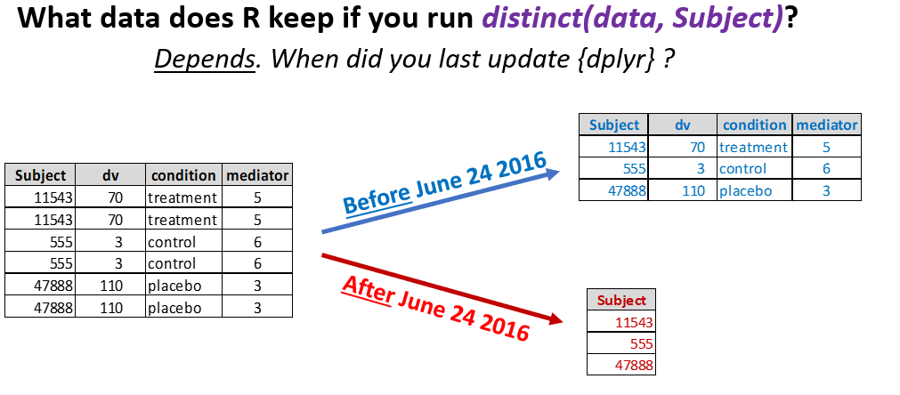

# Tracking package versions with `renv` #

```{r child = 'knitr_config.Rmd'}
```

## `renv`

- [`renv` homepage](https://rstudio.github.io/renv/articles/renv.html)
- Two date-based alternatives
    - [`checkpoint`](https://github.com/RevolutionAnalytics/checkpoint)
    - [`groundhog`](https://groundhogr.com/)
    
## The problem `renv` tries to solve

(ref:datacolada) `dplyr` 0.5.0 introduced a breaking change to `distinct()` in June 2016. Source: <https://datacolada.org/95>

```{r, fig.cap="(ref:datacolada)", echo = FALSE}

```
    
## How R locates packages

```{r}
.libPaths()
```

## `renv` workflow

1. Initialize `renv` for a project with `renv::init()`
2. Track `renv.lock` in version control
3. `renv::snapshot()` to update the lockfile
4. `renv::restore()` to install local copies of the packages to match the lockfile

## Example: with the `learning-make` project

- Check `.libPaths()`
- `renv::init()` (and `snapshot()`?)
- What did this do? 
    - `.libPaths()`
    - `git status`
- Delete `renv/library` and `renv::restore()`

