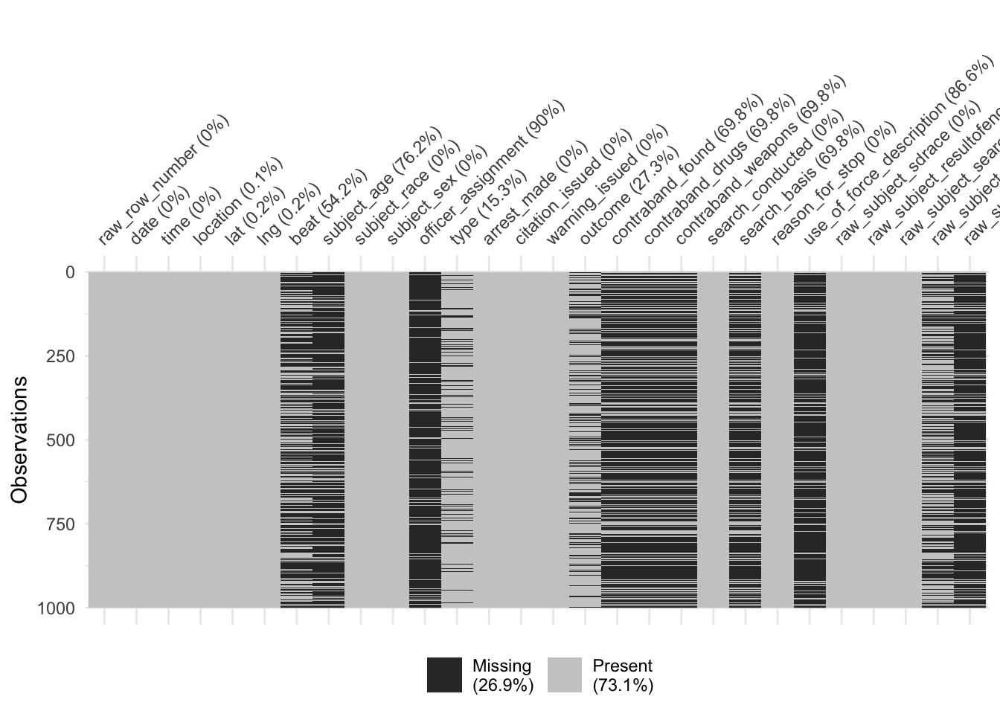

# Inspecting Variables #


## </br>

- For this EDA, we'll work with data on police stops in Oakland, California, that have been pre-cleaned and released by the [Stanford Open Policing Project](https://openpolicing.stanford.edu/) [@PiersonLargescaleAnalysisRacial2020]. 
- Because this analysis focuses on categorical data and counts of observations, most of the elements in @HuebnerSystematicApproachInitial2016 don't really fit.  
    - So we'll follow the checklist from @PengArtDataScience2016. 
- We'll also be learning to use the `skimr` and `visdat` packages


## 1. Formulate your question ##

- The Black Lives Matter protests over the last several years have made us aware of the racial aspects of policing.  

- Here we're specifically interested in
    1. Whether Black people in Oakland might be more likely to be stopped than White people
    2. Whether Black people who are stopped might be more likely to have contraband

- These aren't very precise, but that's okay: 
    Part of the goal of EDA is to clarify and refine our research questions


## Reflexivity {.smaller}

1. Whether Black people in Oakland might be more likely to be stopped than White people
2. Whether Black people who are stopped might be more likely to have contraband

- Once we have a rough idea of *what* we want to know, we need to take a moment to think about *why* we want to know it
    - Clarify what "success" means to us
    - Share with others to whom we're accountable
    - Recognize that we (academic researchers) often lack accountability to people who might be affected by our work
    - **especially when we claim to be acting for their benefit**

- We'll spend 3 minutes writing responses to each of these questions: 

1. What do I already know about this subject? 
2. Why am I studying this? 
3. What do I expect or hope to find/learn, and why? 
4. Who is affected by this topic, and how am I connected to them? 

(Adapted from @TanweerWhyDataRevolution2021, 14-15, and @LiboironPollutionColonialism2021)


## Set up our workspace ##

- Dedicated project folder
- Clean R session
- More on project management and organization later in the semester


## Packages ##


```r
library(tidyverse)   # for working with the data
library(lubridate)   # for working with datetime data

library(skimr)       # generate a text-based overview of the data
library(visdat)      # generate plots visualizing data types and missingness
```


## Get the Data ##

- We'll be using data on police stops in Oakland, California, collected and published by the [Stanford Open Policing Project](https://openpolicing.stanford.edu/).  

- For reproducibility, we'll write a bit of code that automatically downloads the data

- To get the download URL: 
    1. <https://openpolicing.stanford.edu/data/>
    2. Scroll down to Oakland
    3. Right-click on the file symbol to copy the URL
    
- README: <https://github.com/stanford-policylab/opp/blob/master/data_readme.md>.  


```r
data_dir = 'data'
target_file = file.path(data_dir, 'oakland.zip')

if (!dir.exists(data_dir)) {
    dir.create(data_dir)
}
if (!file.exists(target_file)) {
    download.file('https://stacks.stanford.edu/file/druid:yg821jf8611/yg821jf8611_ca_oakland_2020_04_01.csv.zip', 
                  target_file)
}
```

## 2. Read in your data ##

The dataset is a zipped `csv` or comma-separated value file.  CSVs are structured like Excel spreadsheets, but are stored in plain text rather than Excel's format.  


```r
dataf = read_csv(target_file)
## Rows: 133407 Columns: 28
## ── Column specification ────────────────────────────────────────────────────────────────────────────
## Delimiter: ","
## chr  (16): raw_row_number, location, beat, subject_race, subject_sex, officer_assignment, type, ...
## dbl   (3): lat, lng, subject_age
## lgl   (7): arrest_made, citation_issued, warning_issued, contraband_found, contraband_drugs, con...
## date  (1): date
## time  (1): time
## 
## ℹ Use `spec()` to retrieve the full column specification for this data.
## ℹ Specify the column types or set `show_col_types = FALSE` to quiet this message.
```

## 3. Check the packaging ##

@PengArtDataScience2016 use some base R functions to look at dimensions of the dataframe and column (variable) types.  `skimr` is more powerful. 


```r
## May take a couple of seconds
skim(dataf)
## ── Data Summary ────────────────────────
##                            Values
## Name                       dataf 
## Number of rows             133407
## Number of columns          28    
## _______________________          
## Column type frequency:           
##   character                16    
##   Date                     1     
##   difftime                 1     
##   logical                  7     
##   numeric                  3     
## ________________________         
## Group variables            None  
## 
## ── Variable type: character ────────────────────────────────────────────────────────────────────────
##    skim_variable                 n_missing complete_rate   min   max empty n_unique whitespace
##  1 raw_row_number                        0        1          1    71     0   133407          0
##  2 location                             51        1.00       1    78     0    60723          0
##  3 beat                              72424        0.457      3    19     0      129          0
##  4 subject_race                          0        1          5    22     0        5          0
##  5 subject_sex                          90        0.999      4     6     0        2          0
##  6 officer_assignment               121431        0.0898     5    97     0       20          0
##  7 type                              20066        0.850      9    10     0        2          0
##  8 outcome                           34107        0.744      6     8     0        3          0
##  9 search_basis                      92250        0.309      5    14     0        3          0
## 10 reason_for_stop                       0        1         14   197     0      113          0
## 11 use_of_force_description         116734        0.125     10    10     0        1          0
## 12 raw_subject_sdrace                    0        1          1     1     0        7          0
## 13 raw_subject_resultofencounter         0        1          7   213     0      315          0
## 14 raw_subject_searchconducted           0        1          2    24     0       34          0
## 15 raw_subject_typeofsearch          52186        0.609      2   112     0      417          0
## 16 raw_subject_resultofsearch       111633        0.163      5    95     0      298          0
## 
## ── Variable type: Date ─────────────────────────────────────────────────────────────────────────────
##   skim_variable n_missing complete_rate min        max        median     n_unique
## 1 date                  2          1.00 2013-04-01 2017-12-31 2015-07-19     1638
## 
## ── Variable type: difftime ─────────────────────────────────────────────────────────────────────────
##   skim_variable n_missing complete_rate min    max        median n_unique
## 1 time                  2          1.00 0 secs 86340 secs 16:12      1439
## 
## ── Variable type: logical ──────────────────────────────────────────────────────────────────────────
##   skim_variable      n_missing complete_rate   mean count                  
## 1 arrest_made                0         1     0.121  FAL: 117217, TRU: 16190
## 2 citation_issued            0         1     0.394  FAL: 80836, TRU: 52571 
## 3 warning_issued             0         1     0.231  FAL: 102545, TRU: 30862
## 4 contraband_found       92250         0.309 0.149  FAL: 35005, TRU: 6152  
## 5 contraband_drugs       92250         0.309 0.0844 FAL: 37684, TRU: 3473  
## 6 contraband_weapons     92250         0.309 0.0299 FAL: 39928, TRU: 1229  
## 7 search_conducted           0         1     0.309  FAL: 92250, TRU: 41157 
## 
## ── Variable type: numeric ──────────────────────────────────────────────────────────────────────────
##   skim_variable n_missing complete_rate   mean      sd     p0    p25    p50    p75   p100 hist 
## 1 lat                 114         0.999   37.8  0.0284   37.4   37.8   37.8   37.8   38.1 ▁▁▇▁▁
## 2 lng                 114         0.999 -122.   0.0432 -122.  -122.  -122.  -122.  -119.  ▇▁▁▁▁
## 3 subject_age      102724         0.230   33.2 13.3      10     23     29     41     97   ▇▆▃▁▁
```

---

- 133k rows (observations); 28 columns (variables)
- 16 variables are handled as characters
    - `raw_row_number` has 1 unique value per row
        - So it's probably some kind of identifier
    - `subject_race` and `subject_sex` have just 5 and 2 unique values
        - These are probably categorical variables represented as characters
    - Similarly with `type`, `outcome`, and `search_basis`
        - Though these have lots of missing values (high `n_missing`, low `complete_rate`)
- 1 variable represents the date, and another is `difftime`
    - `?difftime` tells us that `difftime` is used to represent intervals or "time differences"
- 7 logical variables
    - A lot of these look like coded outcomes that we might be interested in, eg, `search_conducted` and `contraband_found`
    - `search_conducted` has no missing values, but `contraband_found` has a lot of missing values

## For our motivating questions ##

- Good:  `subject_race` is 100% complete
- Also good:  `search_conducted` is also 100% complete
- Potentially worrisome:  `contraband_found` is only 31% complete

## Missing values ##

- Let's use `visdat::vis_miss()`to 
    - visualize missing values and 
    - check what's up with `contraband_found`. 


```r
## This raises a warning about large data
# vis_miss(dataf)
## So we'll use sample_n() to draw a subset
set.seed(2021-09-28)
dataf_smol = sample_n(dataf, 1000)

vis_miss(dataf_smol)
## Warning: `gather_()` was deprecated in tidyr 1.2.0.
## Please use `gather()` instead.
## This warning is displayed once every 8 hours.
## Call `lifecycle::last_lifecycle_warnings()` to see where this warning was generated.
```



```r

## Arguments in vis_miss() are useful for picking up patterns in missing values
## cluster = TRUE uses hierarchical clustering to order the rows
vis_miss(dataf_smol, cluster = TRUE)
```


--- 

Several variables related to search outcomes are missing together

- `contraband_found`, `contraband_drugs`, `contraband_weapons`, `search_basis`, `use_of_force_description`, `raw_subject_typeofsearch`, and `raw_subject_resultofsearch`

- However, `search_conducted` is complete
    
## A critical question ##

**When a search has been conducted, do we know whether contraband was found?**

- Semi-translated:  when `search_conducted == TRUE`, is `!is.na(contraband_found)`? 
    

```r
dataf %>% 
    filter(search_conducted) %>% 
    mutate(contraband_known = !is.na(contraband_found)) %>% 
    count(search_conducted, contraband_known)
## # A tibble: 1 × 3
##   search_conducted contraband_known     n
##   <lgl>            <lgl>            <int>
## 1 TRUE             TRUE             41157
```

## 4. Look at the top and the bottom of your data ##

With 28 columns, the dataframe is too wide to print in a readable way.  We could use the `select()` function (from the tidyverse) to extract and print a few columns at a time.  

Instead we'll use the base R function `View()` in an interactive session.  This shows us an Excel-like spreadsheet presentation of a dataframe.  

`View()` can cause significant problems if you use it with a large dataframe on a slower machine.  So we'll use a pipe: first extract the `head()` or `tail()` of the dataset, and then `View()` it.  We'll also go ahead and view `dataf_smol`, the subset we created for `visdat` above.  


```r
dataf %>% 
    head() %>% 
    View()

dataf %>% 
    tail() %>% 
    View()

View(dataf_smol)
```

Some of my observations: 

- The ID variable `raw_row_number` can't be turned into a numeric value
- `location` is a mix of addresses and intersections ("Bond St @ 48TH AVE")
    - If we were going to generate a map using this column, geocoding might be tricky
    - Fortunately we also get latitude and longitude columns
- `use_of_force_description` doesn't seem to be a descriptive text field; instead it seems to be mostly missing or "handcuffed"

We can also use `skimr` to check data quality by looking at the minimum and maximum values.  Do these ranges make sense for what we expect the variable to be?  


```r
skim(dataf)
## ── Data Summary ────────────────────────
##                            Values
## Name                       dataf 
## Number of rows             133407
## Number of columns          28    
## _______________________          
## Column type frequency:           
##   character                16    
##   Date                     1     
##   difftime                 1     
##   logical                  7     
##   numeric                  3     
## ________________________         
## Group variables            None  
## 
## ── Variable type: character ────────────────────────────────────────────────────────────────────────
##    skim_variable                 n_missing complete_rate   min   max empty n_unique whitespace
##  1 raw_row_number                        0        1          1    71     0   133407          0
##  2 location                             51        1.00       1    78     0    60723          0
##  3 beat                              72424        0.457      3    19     0      129          0
##  4 subject_race                          0        1          5    22     0        5          0
##  5 subject_sex                          90        0.999      4     6     0        2          0
##  6 officer_assignment               121431        0.0898     5    97     0       20          0
##  7 type                              20066        0.850      9    10     0        2          0
##  8 outcome                           34107        0.744      6     8     0        3          0
##  9 search_basis                      92250        0.309      5    14     0        3          0
## 10 reason_for_stop                       0        1         14   197     0      113          0
## 11 use_of_force_description         116734        0.125     10    10     0        1          0
## 12 raw_subject_sdrace                    0        1          1     1     0        7          0
## 13 raw_subject_resultofencounter         0        1          7   213     0      315          0
## 14 raw_subject_searchconducted           0        1          2    24     0       34          0
## 15 raw_subject_typeofsearch          52186        0.609      2   112     0      417          0
## 16 raw_subject_resultofsearch       111633        0.163      5    95     0      298          0
## 
## ── Variable type: Date ─────────────────────────────────────────────────────────────────────────────
##   skim_variable n_missing complete_rate min        max        median     n_unique
## 1 date                  2          1.00 2013-04-01 2017-12-31 2015-07-19     1638
## 
## ── Variable type: difftime ─────────────────────────────────────────────────────────────────────────
##   skim_variable n_missing complete_rate min    max        median n_unique
## 1 time                  2          1.00 0 secs 86340 secs 16:12      1439
## 
## ── Variable type: logical ──────────────────────────────────────────────────────────────────────────
##   skim_variable      n_missing complete_rate   mean count                  
## 1 arrest_made                0         1     0.121  FAL: 117217, TRU: 16190
## 2 citation_issued            0         1     0.394  FAL: 80836, TRU: 52571 
## 3 warning_issued             0         1     0.231  FAL: 102545, TRU: 30862
## 4 contraband_found       92250         0.309 0.149  FAL: 35005, TRU: 6152  
## 5 contraband_drugs       92250         0.309 0.0844 FAL: 37684, TRU: 3473  
## 6 contraband_weapons     92250         0.309 0.0299 FAL: 39928, TRU: 1229  
## 7 search_conducted           0         1     0.309  FAL: 92250, TRU: 41157 
## 
## ── Variable type: numeric ──────────────────────────────────────────────────────────────────────────
##   skim_variable n_missing complete_rate   mean      sd     p0    p25    p50    p75   p100 hist 
## 1 lat                 114         0.999   37.8  0.0284   37.4   37.8   37.8   37.8   38.1 ▁▁▇▁▁
## 2 lng                 114         0.999 -122.   0.0432 -122.  -122.  -122.  -122.  -119.  ▇▁▁▁▁
## 3 subject_age      102724         0.230   33.2 13.3      10     23     29     41     97   ▇▆▃▁▁
```

- Date range is April 1, 2013 to December 31, 2017
    - If we break things down by year, we should expect 2013 to have fewer cases
    - For some purposes, we might need to exclude 2013 data:  `filter(dataf, date >= '2014-01-01')`
- Age range is from 10 years old (!) to 97 (!)
    - Median (`p50`) is 29; 50% of values are between 23 and 41
    - For some purposes, we might need to restrict the analysis to working-age adults: `filter(dataf, subject_age >= 18, subject_age < 65)`
    
## 5. Check your “n”s (and) 6. Validate with at least one external data source ##

- @PengArtDataScience2016 use an air quality example with a regular sampling rate, 
    - so they can calculate exactly how many observations they should have. 
- We can't do that here
    - So we'll combine steps 5 and 6 together
    
- A web search leads us to this City of Oakland page on police stop data:  <https://www.oaklandca.gov/resources/stop-data>
    - The page mentions a Stanford study that was released in June 2016
    - Recall we got our data from the Stanford Open Policing Project
    - Our data run through December 2017
    - So there's a good chance we're using a superset of the "Stanford study" data
    
    - The page links to this report: <https://cao-94612.s3.amazonaws.com/documents/OPD-Racial-Impact-Report-2016-2018-Final-16Apr19.pdf>
    - Page 8 has two summary tables that we can compare to our data
    
<div class="figure" style="text-align: center">

<p class="caption">(\#fig:unnamed-chunk-11)Screenshot of the two summary tables from the Oakland report.  Source: <https://cao-94612.s3.amazonaws.com/documents/OPD-Racial-Impact-Report-2016-2018-Final-16Apr19.pdf>, page 8</p>
</div>
    
## From dates to years ##

- Our data has the particular date of each stop
    - We need to extract the year of each stop
        - `lubridate::year()` does exactly this
    - Filter to the years in our data that overlap with the tables
    - And then aggregate by year (and gender) using `count`
    

```r
dataf %>% 
    mutate(year = year(date)) %>% 
    filter(year %in% c(2016, 2017)) %>% 
    count(year)
## # A tibble: 2 × 2
##    year     n
##   <dbl> <int>
## 1  2016 30268
## 2  2017 30715

dataf %>% 
    mutate(year = year(date)) %>% 
    filter(year %in% c(2016, 2017)) %>% 
    count(year, subject_sex)
## # A tibble: 6 × 3
##    year subject_sex     n
##   <dbl> <chr>       <int>
## 1  2016 female       7677
## 2  2016 male        22563
## 3  2016 <NA>           28
## 4  2017 female       7879
## 5  2017 male        22818
## 6  2017 <NA>           18
```

- *For both years, we have fewer observations than the report table indicates*
    - Could our data have been pre-filtered? 
    - Let's check the documentation for our data:  <https://github.com/stanford-policylab/opp/blob/master/data_readme.md#oakland-ca>
    
    - "Data is deduplicated on raw columns contactdate, contacttime, streetname, subject_sdrace, subject_sex, and subject_age, reducing the number of records by ~5.2%"
        - The difference with the report is on this order of magnitude, 
        - But varies within groups by several percentage points
        - So deduplication *might* explain the difference
        - But in a more serious analysis we might want to check, eg, with the Stanford Open Policing folks
    

```r
## Men in 2016 in the report vs. our data: 8.2%
(24576 - 22563) / 24576
## [1] 0.08190918

## Women in 2016 in the report vs. our data: 3.6%
(7965 - 7677) / 7965
## [1] 0.03615819

## All of 2016 in the report vs. our data: 7.1%
(32569 - 30268) / 32569
## [1] 0.07065
```

## 7. Make a plot ##

Plotting is a whole additional discussion.  We'll talk about it next week.  

## 8. Try the easy solution first ##

We are interested in two rough questions:  

1. Whether Black people in Oakland might be more likely to be stopped than White people
2. Whether Black people who are stopped might be more likely to have contraband

- The easy solution is to count rows and then shares within groups

## Number of stops, by race ##


```r
dataf %>% 
    count(subject_race) %>% 
    mutate(share = n / sum(n)) %>% 
    arrange(desc(share))
## # A tibble: 5 × 3
##   subject_race               n  share
##   <chr>                  <int>  <dbl>
## 1 black                  78925 0.592 
## 2 hispanic               26257 0.197 
## 3 white                  15628 0.117 
## 4 asian/pacific islander  8099 0.0607
## 5 other                   4498 0.0337
```

- Police stop demographics
    - 60% of subjects stopped by police are Black
    - 19% are Hispanic
    - 12% are White
    - 6% are API
- Oakland demographics: <https://en.wikipedia.org/wiki/Oakland,_California#Race_and_ethnicity>
    - 23% of residents are Black
    - 27% are Hispanic
    - 29% are non-Hispanic White
    - 15% are Asian
- Comparing the two
    - *Blacks are severely overrepresented in police stops*
    - Hispanics and API folks are slightly underrepresented
    - Whites are significantly underrepresented

## Contraband search results, by race ##

- What fraction of stops had a search?  
- Are there disparities by race there?  


```r
## What fraction of stops had a search? 
dataf %>% 
    count(search_conducted) %>% 
    mutate(share = n / sum(n))
## # A tibble: 2 × 3
##   search_conducted     n share
##   <lgl>            <int> <dbl>
## 1 FALSE            92250 0.691
## 2 TRUE             41157 0.309
```

Across all subjects, 31% of stops involved a search. 

---

- For the other question, we need to calculate something like `share` *within* racial groups.  
    - That is, among all stops *of Black folks*, what fraction involved a search?  
    - This is a just for `group_by()`
- Remember to `ungroup()`


```r
## What fraction of stops had a search, by race? 
## Note that, for each racial group, `share` adds up to 100%. 
## 
## For all groups, most stops didn't involve a search; 
## For Black subjects, 38% of stops involved a search; 
## For White subjects, 15% of stops involved a search. 
dataf %>% 
    group_by(subject_race) %>% 
    count(search_conducted) %>% 
    mutate(share = n / sum(n)) %>% 
    ungroup() %>% 
    filter(search_conducted)
## # A tibble: 5 × 4
##   subject_race           search_conducted     n share
##   <chr>                  <lgl>            <int> <dbl>
## 1 asian/pacific islander TRUE              1304 0.161
## 2 black                  TRUE             30025 0.380
## 3 hispanic               TRUE              6722 0.256
## 4 other                  TRUE               706 0.157
## 5 white                  TRUE              2400 0.154
```

- For all groups, most stops didn't involve a search
- For Black subjects, 38% of stops involved a search
- For White subjects, 15% of stops involved a search

- *So police were much more likely to search stopped Black subjects than White subjects*

---

Finally, let's consider our second main question:  contraband results from searches.  

Note that we want to restrict ourselves to only stops where `search_conducted` is true.  


```r
## Contraband results from searches, by race
dataf %>% 
    filter(search_conducted) %>% 
    count(subject_race, contraband_found) %>% 
    group_by(subject_race) %>% 
    mutate(share = n / sum(n)) %>% 
    ungroup() %>% 
    filter(contraband_found)
## # A tibble: 5 × 4
##   subject_race           contraband_found     n share
##   <chr>                  <lgl>            <int> <dbl>
## 1 asian/pacific islander TRUE               176 0.135
## 2 black                  TRUE              4364 0.145
## 3 hispanic               TRUE              1116 0.166
## 4 other                  TRUE                85 0.120
## 5 white                  TRUE               411 0.171
```

- For Black subjects who were searched, contraband was found 15% of the time
- For White subjects, 17% of the time

**This preliminary analysis indicates that Black subjects were more likely to be searched than White subjects; but, when they were searched, White subjects were more likely to have contraband.**

## 9. Follow up ##

- There are several directions we could take this analysis:  
    - Investigate outstanding questions about quality and reliability of the data
        - eg, follow up with Stanford Open Policing Project about the difference in row counts
        - Fits with *epicycle of analysis*: checking expectations

    - Break down our question into more fine-grained analyses
        - eg, the Oakland web site and report talk about policy changes; do we see changes by year in the data? 
        - Fits with *epicycle of analysis*: refine and specify research questions

    - Apply more sophisticated statistical analysis
        - eg, a regression model to control for age, gender, and other covariates
        - Fits with *phenomena development*: reducing data, eliminating noise, in order to identity local phenomena


## Discussion questions ##

1. Suppose you've conducted this EDA because you're working with an activist organization that promotes defunding the police and prison abolition.  Should you share the preliminary findings above with your organization contacts?  

2. What influence should the following factors make to your answer?  
    - Funding: Whether you're being paid as a consultant vs. volunteering your expertise
    - Values: Your own views about policing and prisons
    - Relationships: Whether you are friends with members of the activist organization and/or police
    - Communications: The degree to which you can control whether and how the organization will publish your preliminary findings
    - Timeliness:  Whether these findings are relevant to a pending law or policy change
    
3. What other factors should be taken into account as you decide whether to share your findings?  Or not taken into account? 

4. How has this "raw data" been shaped by the journey of the data to get to us? 


## Lab ##

The lab related to this material is available at <https://github.com/data-science-methods/lab-w06-eda>. 


## References
