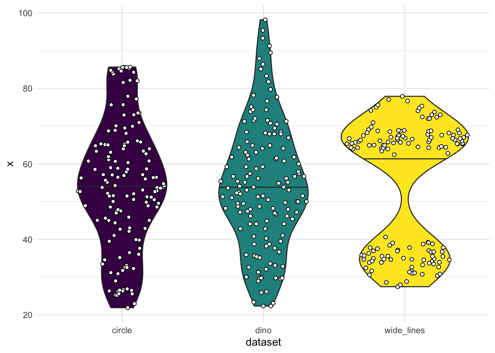

# Visual EDA #

## Reading

- Reading: @WeissgerberBarLineGraphs2015
- Further reading: @HealyDataVisualizationPractical2018, ch. 1; @MatejkaSameStatsDifferent


## The Role of Visuals in EDA ##

- @TukeyExploratoryDataAnalysis1977 emphasized visual methods for EDA
- Including not just graphs but also structured tables, such as [stem-and-leaf displays](https://en.wikipedia.org/wiki/Stem-and-leaf_display)


<div class="figure" style="text-align: center">

<p class="caption">(\#fig:unnamed-chunk-2)A stem-and-leaf display, promoted by Tukey for use in EDA</p>
</div>

---

## In terms of our models of EDA ##

### Epicycle of analysis

- Check expectations about the distribution of variables
    - Outliers 
    - Degeneracies (eg, perfect correlation)
    - Skew or bimodal distributions
    - Non-linear relationships
- Develop expectations about relationships between variables

### Phenomena development 

- Quickly identify potential patterns
- Contrast potential patterns with noise/uncertainty/imprecision


## Plot Your Data ##

- Summary statistics almost always focus only on central tendency (mean, median) and dispersion (standard deviation, IQR)
    - This is all you would need if the world were made of normal distributions
        - (Or at least unimodal symmetric ones)
    - The world is not made of normal distributions [@LyonWhyAreNormal2014]
        - (Or even unimodal symmetric ones) 

- We'll illustrate this using The Datasaurus Dozen [@MatejkaSameStatsDifferent]

---


```r
library(tidyverse)
library(datasauRus)
library(ggforce)

## We'll need this, but don't want to load it
## install.packages('Hmisc')

theme_set(theme_minimal())

ds_df = datasaurus_dozen
```

---

- The dataset combines 13 different datasets with $n=142$ for each


```r
ds_df
## # A tibble: 1,846 × 3
##    dataset     x     y
##    <chr>   <dbl> <dbl>
##  1 dino     55.4  97.2
##  2 dino     51.5  96.0
##  3 dino     46.2  94.5
##  4 dino     42.8  91.4
##  5 dino     40.8  88.3
##  6 dino     38.7  84.9
##  7 dino     35.6  79.9
##  8 dino     33.1  77.6
##  9 dino     29.0  74.5
## 10 dino     26.2  71.4
## # … with 1,836 more rows
count(ds_df, dataset)
## # A tibble: 13 × 2
##    dataset        n
##    <chr>      <int>
##  1 away         142
##  2 bullseye     142
##  3 circle       142
##  4 dino         142
##  5 dots         142
##  6 h_lines      142
##  7 high_lines   142
##  8 slant_down   142
##  9 slant_up     142
## 10 star         142
## 11 v_lines      142
## 12 wide_lines   142
## 13 x_shape      142
```

---

- The datasets have the same means, standard deviations, and (Pearson) correlation coefficient
    - p-value of the correlation coefficient is not statistically significant


```r
## This is a more complex summarize() call than we've seen before
## 1. Number of rows
## 2. "Summarize across the columns x and y, using the functions mean and sd"; automatically generates names
## 3. Correlation between x and y
## 4. p-value from a t-test of the null that the correlation = 0
ds_df %>% 
    group_by(dataset) %>% 
    summarize(n = n(), 
              across(.cols = c(x, y), 
                     .fns = lst(mean, sd)), 
              cor_xy = cor(x, y), 
              p_value = cor.test(x, y)$p.value) %>% 
    ungroup()
## # A tibble: 13 × 8
##    dataset        n x_mean  x_sd y_mean  y_sd  cor_xy p_value
##    <chr>      <int>  <dbl> <dbl>  <dbl> <dbl>   <dbl>   <dbl>
##  1 away         142   54.3  16.8   47.8  26.9 -0.0641   0.448
##  2 bullseye     142   54.3  16.8   47.8  26.9 -0.0686   0.417
##  3 circle       142   54.3  16.8   47.8  26.9 -0.0683   0.419
##  4 dino         142   54.3  16.8   47.8  26.9 -0.0645   0.446
##  5 dots         142   54.3  16.8   47.8  26.9 -0.0603   0.476
##  6 h_lines      142   54.3  16.8   47.8  26.9 -0.0617   0.466
##  7 high_lines   142   54.3  16.8   47.8  26.9 -0.0685   0.418
##  8 slant_down   142   54.3  16.8   47.8  26.9 -0.0690   0.415
##  9 slant_up     142   54.3  16.8   47.8  26.9 -0.0686   0.417
## 10 star         142   54.3  16.8   47.8  26.9 -0.0630   0.457
## 11 v_lines      142   54.3  16.8   47.8  26.9 -0.0694   0.412
## 12 wide_lines   142   54.3  16.8   47.8  26.9 -0.0666   0.431
## 13 x_shape      142   54.3  16.8   47.8  26.9 -0.0656   0.438
```

---

- But, when plotted, they're obviously very different 


```r
ggplot(ds_df, aes(x, y)) +
    geom_point() +
    facet_wrap(vars(dataset))
```


## Bar plots, and better than bar plots ##

- @WeissgerberBarLineGraphs2015 argue for the importance of plotting data, not just summaries, even in publications

- Let's pull a few datasets out of datasaurus, as though they were groups in a study


```r
cdw_df = ds_df |> 
    filter(dataset %in% c('circle', 'dino', 'wide_lines'))
```

## A bar plot of mean + 95% CI


```r
ggplot(cdw_df, aes(x = dataset, 
                   y = x)) +
    stat_summary(geom = 'errorbar', width = 0.2,
                 fun.data = mean_cl_boot, 
                 fun.args = list(conf.int = .95)) +
    stat_summary(geom = 'bar', fun = mean, 
                 aes(fill = dataset)) +
    scale_fill_viridis_d(guide = 'none')
## Warning: Computation failed in `stat_summary()`:
```


## Replace the bar with the data


```r
ggplot(cdw_df, aes(x = dataset, 
                   y = x)) +
    # geom_point(aes(color = dataset)) +
    geom_sina(aes(fill = dataset), 
              shape = 21L) +
    stat_summary(geom = 'errorbar', width = 0.2,
                 fun.data = mean_cl_boot) +
    scale_color_viridis_d(guide = 'none', 
                          aesthetics = c('color', 'fill'))
## Warning: Computation failed in `stat_summary()`:
```


## Even fancier: Violin plot ##


```r
ggplot(cdw_df, aes(x = dataset, y = x, fill = dataset)) +
    geom_violin(draw_quantiles = c(.5)) +
    geom_sina(shape = 21, fill = 'white') +
    scale_fill_viridis_d(guide = 'none')
```




## References ##
