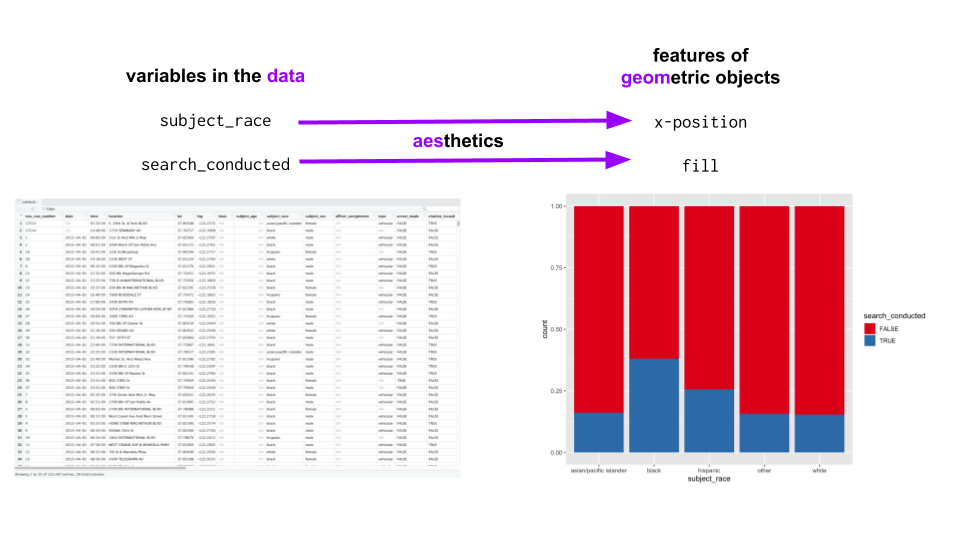
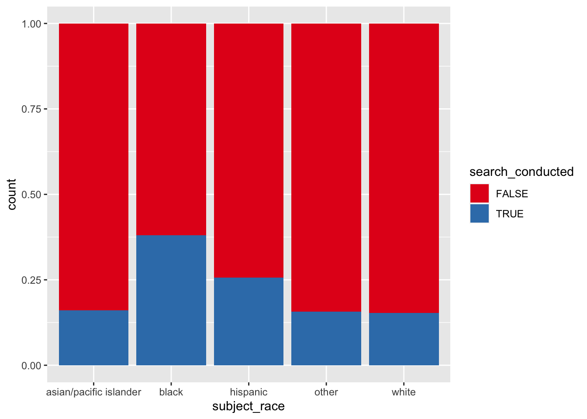

# The Grammar of Graphics #


## Reading

- @WickhamGgplot2ElegantGraphics, ch. 13, "Mastering the Grammar"
- Further reading: @WilkinsonGrammarGraphics1999; @WickhamLayeredGrammarGraphics2010

## Artist's palette model ##

Many programming languages use the *artist's palette* model of computer graphics

- Define some low-level tools for drawing on a canvas: `points()`, `lines()`, `curve()`
- One-liners that bundle these tools into standard plots: `hist()`, `barplot()`
- This is used by base graphics in R, Python packages including `matplotlib` and `seaborn`, MATLAB, etc.
- In R: base graphics are *side effects*, not first-class objects

<div class="figure" style="text-align: center">

<p class="caption">(\#fig:unnamed-chunk-2)`matplotlib`, a popular Python package for graphing, uses the artist's palette model.  Source: <https://matplotlib.org/stable/gallery/subplots_axes_and_figures/subplot.html></p>
</div>

## Grammar of graphics ##

The *grammar of graphics* is a fundamentally different approach

- Implemented by `ggplot2` in the tidyverse

<div class="figure" style="text-align: center">

<p class="caption">(\#fig:unnamed-chunk-3)The Grammar of Graphics regards graphs as mappings from variables in the data to features of geometric objects. This means that every graph is a model.</p>
</div>

## Graphs are maps

- A graph is a mapping from variables in the data to features of geometric objects
- An individual mapping is called an *aesthetic*
- So a graph is a collection of aesthetics applied to a dataset


```r
oakland_df = read_csv(file.path('data', 'oakland.zip'), 
                      show_col_types = FALSE)

ggplot(data = oakland_df, 
       aes(x = subject_race, fill = search_conducted)) +
    geom_bar(position = 'fill') +
    scale_fill_brewer(palette = 'Set1')
```



## Graphs are models

- Simplifications of the data
- That provide us with cognitive affordances
    - Fit with our cognitive capabilities
    - Support pattern detection, inference
- Direct our attention to certain things and away from others
- Involve researcher degrees of freedom

<br>

Consider the bar plots vs. dots + CI plots vs. violin plots from the last chapter

- How do these simplify the data? 
- In doing so, how do they provide us with cognitive affordances? 
- How do these different in terms of where they direct our attention? 
- What researcher degrees of freedom does each involve? 

## References 
