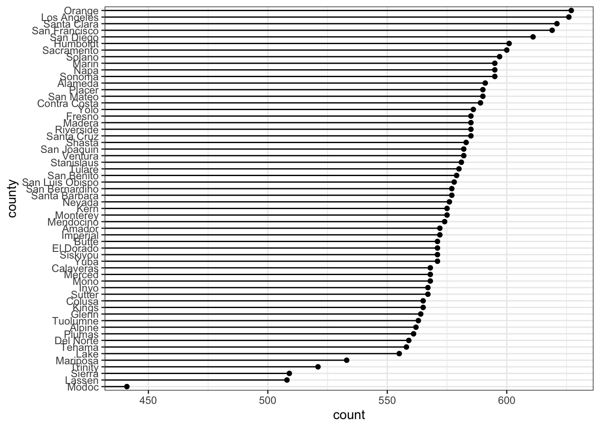
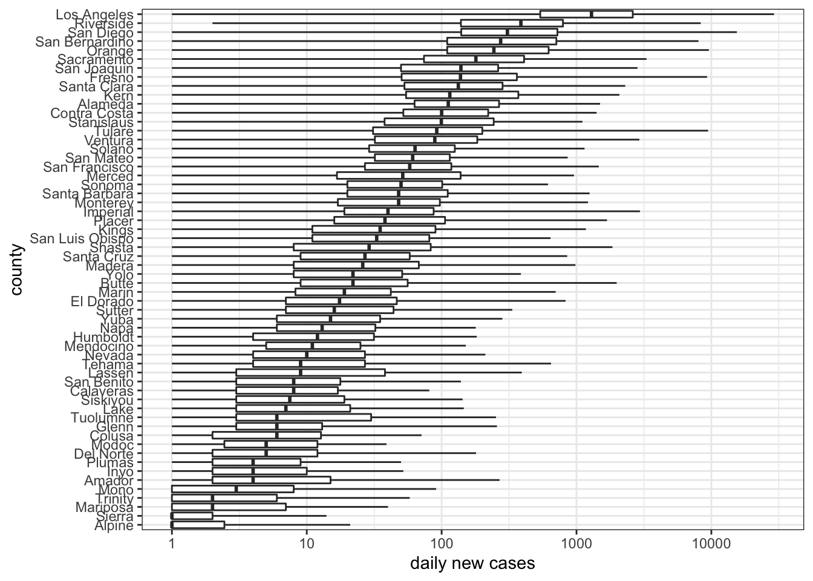
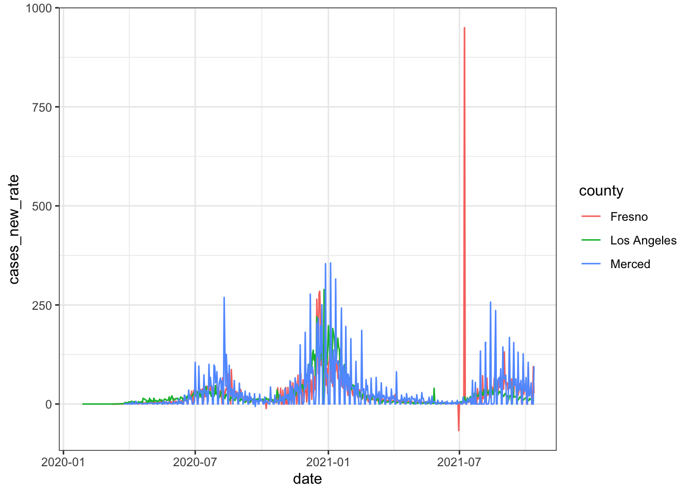
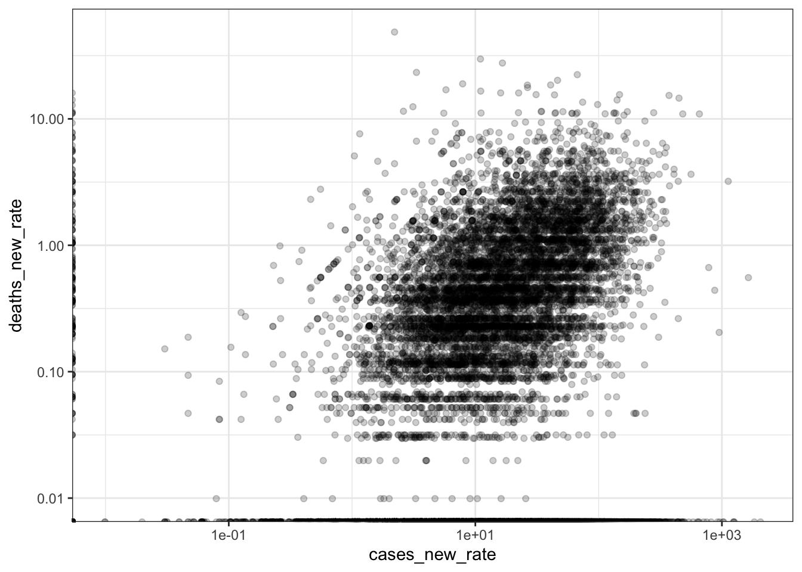

# Covid EDA #

## </br>


- This EDA will start in class and continue on to the lab
- We're interested in *the role of social distancing in the July 2020 Covid wave in California*

## The standard narrative ##

The standard narrative about the July 2020 wave goes like this: 

- California had some of the first confirmed cases of Covid-19 in the US
- California was also the first state to institute a stay-at-home order and encourage social distancing
- These social distancing policies are why California did not experience the large first wave in March 2020 (contrast NYC)
- Starting in May 2020, these policies were relaxed and "lockdown fatigue" meant that people were ignoring them anyways
- This is why California did experience a more significant wave in July 2020

--- 

Our research question:  Is reduced social distancing (measured using cellphone tracking data) correlated with increased Covid-19 case counts 4 weeks later? 

</br>

In class, we'll just be looking at the case counts. 

## Reflexivity

(For time, you'll do these on your own as part of the lab.)

## Setup 


```r
library(tidyverse)
library(tidylog)
library(skimr)
library(visdat)

library(assertthat)

theme_set(theme_bw())
```


## Data ##

To save some time in class, I've prepared a CSV that combines three datasets: 

- [Covid-19 case and death counts, at the county level, collected by the *New York Times*](https://github.com/nytimes/covid-19-data/blob/master/README.md)
- Estimated county populations in 2018, from the US Census' American Community Survey
- ["Mobility data," based on cellphone tracking, from Google](https://kjhealy.github.io/covmobility/reference/google_mobility.html)

The dataset has also been filtered down to California.  

## Get the data ##

- This week's lab on GitHub
    - <https://github.com/data-science-methods/lab_w06_covid>
- `data` -> `covid.csv` -> "Download" (right-click and copy)


```r
covid_file = file.path('data', 'covid.csv')
covid_url = 'https://github.com/data-science-methods/lab_w06_covid/raw/main/data/covid.csv'
if (!file.exists(covid_file)) {
    download.file(covid_url, covid_file)
}
## Original version
# covid_df = read_csv(covid_file, show_col_types = FALSE)
## With daily change
covid_df = read_csv(covid_file, show_col_types = FALSE) |> 
    group_by(county) |>
    mutate(across(.cols = c(cases, deaths),
                  .fns = list(new = daily_new), date)) |> 
    ungroup() |> 
    mutate(across(.cols = c(matches('cases'), matches('deaths')), 
                  .fns = list(rate = ~ .x / population * 100000)))
## group_by: one grouping variable (county)
## mutate (grouped): new variable 'cases_new' (double) with 1,737 unique values and <1% NA
##                   new variable 'deaths_new' (double) with 168 unique values and <1% NA
## ungroup: no grouping variables
## mutate: new variable 'cases_rate' (double) with 24,351 unique values and 0% NA
##         new variable 'cases_new_rate' (double) with 9,753 unique values and <1% NA
##         new variable 'deaths_rate' (double) with 8,485 unique values and 0% NA
##         new variable 'deaths_new_rate' (double) with 1,056 unique values and <1% NA
```

## Some quick data checking ##


```r
skim(covid_df)
```


Table: (\#tab:unnamed-chunk-2)Data summary

|                         |         |
|:------------------------|:--------|
|Name                     |covid_df |
|Number of rows           |33322    |
|Number of columns        |19       |
|_______________________  |         |
|Column type frequency:   |         |
|character                |3        |
|Date                     |1        |
|numeric                  |15       |
|________________________ |         |
|Group variables          |None     |


**Variable type: character**

|skim_variable | n_missing| complete_rate| min| max| empty| n_unique| whitespace|
|:-------------|---------:|-------------:|---:|---:|-----:|--------:|----------:|
|county        |         0|             1|   4|  15|     0|       58|          0|
|state         |         0|             1|  10|  10|     0|        1|          0|
|fips          |         0|             1|   5|   5|     0|       58|          0|


**Variable type: Date**

|skim_variable | n_missing| complete_rate|min        |max        |median     | n_unique|
|:-------------|---------:|-------------:|:----------|:----------|:----------|--------:|
|date          |         0|             1|2020-01-25 |2021-10-12 |2020-12-29 |      627|


**Variable type: numeric**

|skim_variable   | n_missing| complete_rate|      mean|         sd|       p0|      p25|       p50|       p75|        p100|hist  |
|:---------------|---------:|-------------:|---------:|----------:|--------:|--------:|---------:|---------:|-----------:|:-----|
|cases           |         0|          1.00|  38007.85|  128692.55|     1.00|   479.25|   4458.00|  23744.50|  1473123.00|▇▁▁▁▁ |
|deaths          |         0|          1.00|    590.84|    2290.48|     0.00|     5.00|     55.00|    299.00|    26346.00|▇▁▁▁▁ |
|population      |         0|          1.00| 708598.07| 1508235.90|  1146.00| 53932.00| 186661.00| 765935.00| 10098052.00|▇▁▁▁▁ |
|retail          |     15286|          0.54|    -25.50|      16.78|  -100.00|   -35.00|    -25.00|    -16.00|       63.00|▁▃▇▁▁ |
|grocery         |     16225|          0.51|     -5.84|      13.46|   -74.00|   -14.00|     -7.00|      1.00|       86.00|▁▆▇▁▁ |
|parks           |     18301|          0.45|      2.16|      40.35|   -83.00|   -22.00|     -3.00|     18.00|      323.00|▇▆▁▁▁ |
|transit         |     18639|          0.44|    -29.67|      27.29|   -88.00|   -49.00|    -32.00|    -15.00|       97.00|▃▇▂▁▁ |
|workplaces      |     14112|          0.58|    -30.74|      15.01|   -87.00|   -39.00|    -31.00|    -20.00|       11.00|▁▂▇▇▁ |
|residential     |     17022|          0.49|     10.82|       6.33|    -7.00|     6.00|     10.00|     14.00|       37.00|▁▇▆▂▁ |
|cases_new       |        58|          1.00|    144.62|     680.67| -1157.00|     0.00|     13.00|     77.00|    29174.00|▇▁▁▁▁ |
|deaths_new      |        58|          1.00|      2.11|      12.92|  -423.00|     0.00|      0.00|      1.00|      930.00|▁▇▁▁▁ |
|cases_rate      |         0|          1.00|   4714.32|    4521.80|     0.01|   541.96|   3567.44|   7764.35|    23466.41|▇▃▂▁▁ |
|cases_new_rate  |        58|          1.00|     20.11|      45.88|  -211.66|     0.00|      6.53|     21.91|     2055.69|▇▁▁▁▁ |
|deaths_rate     |         0|          1.00|     58.83|      65.99|     0.00|     5.53|     38.53|     88.80|      422.27|▇▂▁▁▁ |
|deaths_new_rate |        58|          1.00|      0.24|       1.04|   -31.56|     0.00|      0.00|      0.05|       48.63|▁▇▁▁▁ |

## Variables ##

- `county`, `state`, and `fips` are all geographic identifiers, and complete
    - 58 unique values for both `county` and `fips`
    - How many counties does California have? 
- `date` gives the date, is also complete
- `cases` and `deaths` come from the NYT covid data
- `population` comes from the Census
- `retail`, `grocery`, `parks`, `transit`, `workplaces`, and `residential` come from the Google Mobility data
    - Much lower completion rate

## Too many timeseries plots ##


```r
ggplot(covid_df, aes(date, cases)) +
    geom_line() +
    facet_wrap(vars(county), 
               scales = 'free_y')
```


## Number of observations per county ##


```r
ggplot(covid_df, aes(fct_rev(fct_infreq(county)))) +
    # geom_bar() +
    geom_point(stat = 'count') +
    geom_segment(stat = 'count', 
                 aes(xend = county),
                 yend = 0) +
    coord_flip() +
    labs(x = 'county')
```



*Why do different counties have different numbers of observations?*


## No more than 1 observation per county per day ##


```r
covid_df |> 
    count(county, date) |> 
    filter(n > 1) |> 
    nrow() |> 
    identical(0L) |> 
    assert_that(msg = 'More than 1 observation per county per day')
## count: now 33,322 rows and 3 columns, ungrouped
## filter: removed all rows (100%)
## [1] TRUE
```


## Cumulative vs. daily cases ##

Both `cases` and `deaths` are cumulative, not the daily new value


```r
covid_df |> 
    filter(county == 'Merced') |> 
    ggplot(aes(date, cases)) +
    geom_line()
## filter: removed 32,754 rows (98%), 568 rows remaining
```


---

- We'll write a little function to calculate the differences
- Incorporate it into the pipe that loads the data
    - Then restart R and rerun


```r
daily_new = function(x, order_var) {
    diff = x - dplyr::lag(x, order_by = order_var)
    return(diff)
}
```

---

- Test it on Orange and LA Counties


```r
covid_df |>
    filter(county %in% c('Orange', 'Los Angeles')) |>
    group_by(county) |>
    mutate(across(.cols = c(cases, deaths),
                  .fns = list(new = daily_new), date)) |>
    select(date, county, matches('cases'), matches('deaths')) |> 
    View()
```

---

Now we have daily values


```r
covid_df |> 
    filter(county == 'Merced') |> 
    ggplot(aes(date, cases_new)) +
    geom_line()
## filter: removed 32,754 rows (98%), 568 rows remaining
## Warning: Removed 1 row(s) containing missing values (geom_path).
```


## Add an assertion ##

- For each county, the first daily diff should be `NA`
- But none of the others


```r
covid_df |> 
    group_by(county) |> 
    slice(-1) |> 
    pull(cases_new) |> 
    is.na() |> 
    any() |> 
    magrittr::not() |> 
    assert_that(msg = 'missing values in cases_new')
## group_by: one grouping variable (county)
## slice (grouped): removed 58 rows (<1%), 33,264 rows remaining
## [1] TRUE
```

## Distribution of cases by county ##

First pass is hard to read


```r
ggplot(covid_df, aes(county, cases_new)) +
    geom_boxplot()
## Warning: Removed 58 rows containing non-finite values (stat_boxplot).
```


## Revisions

- `coef = 1000`
- y-axis on a log scale
- flip the coordinates
- reorder the counties by median number of cases
- filter out `cases_new == 0`
- meaningful axis labels


```r
covid_df |> 
    filter(cases_new > 0) |>
    ggplot(aes(fct_reorder(county, cases_new, 
                           .fun = median, na.rm = TRUE),
                     cases_new)) +
    geom_boxplot(coef = 1000) +
    scale_y_log10() +
    coord_flip() +
    labs(x = 'county', y = 'daily new cases')
## filter: removed 9,133 rows (27%), 24,189 rows remaining
```



## 9 plots of the same plot ##


```r
ggplot(covid_df, aes(x = cases_new, y = deaths_new)) +
    # geom_point() +
    # geom_point(alpha = .2) +
    # geom_count(alpha = .5) +
    # geom_bin2d() +
    # geom_hex() +
    # geom_hex(aes(color = after_stat(count))) +
    # geom_density2d(size = 1) +
    # stat_density2d(contour = FALSE, geom = 'raster',
    #                aes(fill = after_stat(density)),
    #                show.legend = FALSE) +
    stat_density2d(contour = TRUE, geom = 'polygon',
                   aes(fill = after_stat(level)),
                   show.legend = FALSE) +
    scale_x_log10() +
    scale_y_log10() +
    scale_color_viridis_c(aesthetics = c('color', 'fill'))
## Warning in self$trans$transform(x): NaNs produced
## Warning: Transformation introduced infinite values in continuous x-axis
## Warning in self$trans$transform(x): NaNs produced
## Warning: Transformation introduced infinite values in continuous y-axis
## Warning: Removed 25048 rows containing non-finite values (stat_density2d).
```


## Why so many dropped values? ##

- The binned plots drop 25,048 rows, or 75% of the data
- Why? 


```r
covid_df |> 
    mutate(log_cases_new = log(cases_new)) |> 
    select(cases_new, log_cases_new) |> 
    filter(!is.finite(log_cases_new)) |> 
    count(cases_new) |> 
    arrange(desc(n))
## Warning in log(cases_new): NaNs produced
## mutate: new variable 'log_cases_new' (double) with 1,682 unique values and 1% NA
## select: dropped 18 variables (date, county, state, fips, cases, …)
## filter: removed 24,189 rows (73%), 9,133 rows remaining
## count: now 58 rows and 2 columns, ungrouped
## # A tibble: 58 × 2
##    cases_new     n
##        <dbl> <int>
##  1         0  8829
##  2        -1   113
##  3        NA    58
##  4        -2    27
##  5        -3    11
##  6        -6     9
##  7        -8     8
##  8       -17     4
##  9       -12     4
## 10        -5     4
## # … with 48 more rows
```

## Cases vs. population ##


```r
ggplot(covid_df, aes(population, cases_new)) +
    geom_point()
## Warning: Removed 58 rows containing missing values (geom_point).
```


## Absolute counts to rates ##

- `cases` and `deaths` are absolute counts
- But county populations differ over orders of magnitude
- *Construct a lollipop plot to illustrate this*


```r
covid_df |> 
    select(county, population) |> 
    distinct() |> 
    ggplot(aes(x = fct_reorder(county, population), 
               y = population)) +
    geom_point() +
    geom_segment(aes(xend = county), yend = 0) +
    scale_y_log10() +
    coord_flip()
## select: dropped 17 variables (date, state, fips, cases, deaths, …)
## distinct: removed 33,264 rows (>99%), 58 rows remaining
```


---

Let's calculate rates for new and cumulative cases and deaths


```r
test_df = covid_df |> 
    mutate(across(.cols = c(matches('cases'), matches('deaths')), 
                  .fns = list(rate = ~ .x / population * 100000)))
## mutate: new variable 'cases_rate_rate' (double) with 24,355 unique values and 0% NA
##         new variable 'cases_new_rate_rate' (double) with 9,755 unique values and <1% NA
##         new variable 'deaths_rate_rate' (double) with 8,485 unique values and 0% NA
##         new variable 'deaths_new_rate_rate' (double) with 1,056 unique values and <1% NA

test_df |> 
    filter(county %in% c('Merced', 'Fresno', 'Los Angeles')) |> 
    ggplot(aes(date, cases_new_rate, 
               group = county, color = county)) +
    geom_line()
## filter: removed 31,543 rows (95%), 1,779 rows remaining
## Warning: Removed 3 row(s) containing missing values (geom_path).
```



*Incorporate this into the pipe when we load `covid_df`*

## Rates vs. population ##


```r
ggplot(covid_df, aes(population, cases_new_rate)) +
    geom_point()
## Warning: Removed 58 rows containing missing values (geom_point).
```


## Counties by maximum rate of new cases ##


```r
covid_df |> 
    group_by(county) |> 
    summarize(population = max(population),
              cases = max(cases_new_rate, na.rm = TRUE)) |> 
    arrange(desc(cases))
## group_by: one grouping variable (county)
## summarize: now 58 rows and 3 columns, ungrouped
## # A tibble: 58 × 3
##    county   population cases
##    <chr>         <dbl> <dbl>
##  1 Tulare       460477 2056.
##  2 Alpine         1146 1832.
##  3 Imperial     180216 1640.
##  4 Lassen        31185 1260.
##  5 Shasta       179085 1032.
##  6 Tehama        63373 1023.
##  7 Fresno       978130  950.
##  8 Glenn         27897  921.
##  9 Butte        227075  875.
## 10 Kings        150075  782.
## # … with 48 more rows
```


## Cases vs. deaths when we control for population ##


```r
ggplot(covid_df, aes(x = cases_new_rate, y = deaths_new_rate)) +
    # geom_point() +
    geom_point(alpha = .2) +
    # geom_count(alpha = .5) +
    # geom_bin2d() +
    # geom_hex() +
    # geom_hex(aes(color = after_stat(count))) +
    # geom_density2d(size = 1) +
    # stat_density2d(contour = FALSE, geom = 'raster',
    #                aes(fill = after_stat(density)),
    #                show.legend = FALSE) +
    # stat_density2d(contour = TRUE, geom = 'polygon',
    #                aes(fill = after_stat(level)),
    #                show.legend = FALSE) +
    scale_x_log10() +
    scale_y_log10() +
    scale_color_viridis_c(aesthetics = c('color', 'fill'))
## Warning in self$trans$transform(x): NaNs produced
## Warning: Transformation introduced infinite values in continuous x-axis
## Warning in self$trans$transform(x): NaNs produced
## Warning: Transformation introduced infinite values in continuous y-axis
## Warning: Removed 556 rows containing missing values (geom_point).
```


