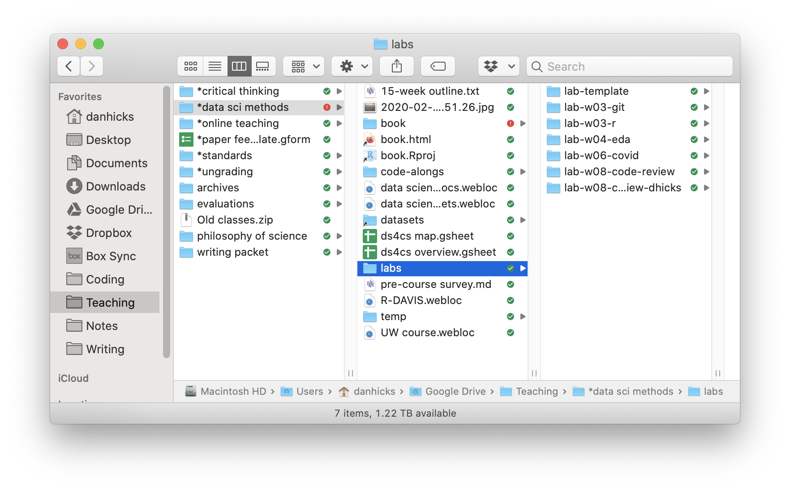

# The life-changing magic of tidying your projects #


## Reading

- @NobleQuickGuideOrganizing2009

### Some data management disasters

- @ArrayErrors2011, @VideoKeithBaggerly
- @HerndonDoesHighPublic2014, but you can just read @BaileyReinhartRogoffErrorHow, @CassidyReinhartRogoffControversy, and/or watch @ReinhartRogoffGrowth2019
- @LaskowskiWhatWhenYou, @ViglioneAvalancheSpiderpaperRetractions2020, @PennisiProminentSpiderBiologist2020
- @HowExcelMay2020

## Dumpster organization

<div class="figure" style="text-align: center">

<p class="caption">(\#fig:unnamed-chunk-2)😱 Source: <https://pbs.twimg.com/media/DFca5SRXsAAx1NA></p>
</div>

- Dump all of your files into one place
- Use search tools to find what you want
- Just assume that things aren't getting corrupted
- The way many Gen Z students think about their files?  [@ChinStudentsWhoGrew2021]

## Project organization

- Keep your project self-contained
- Locate files quickly
- Play nicely with version control
- Self-document key relationships between project files

<div class="figure" style="text-align: center">

<p class="caption">(\#fig:unnamed-chunk-3)Folder organization is your friend. I have top-level folders for teaching, coding, and writing projects. Then each project or collection of projects lives in its own folder. An 'Archives' folder is good for tucking old projects out of the way.</p>
</div>

## Model 1: @NobleQuickGuideOrganizing2009 ##

<div class="figure" style="text-align: center">

<p class="caption">(\#fig:unnamed-chunk-4)Noble's [-@NobleQuickGuideOrganizing2009] sample folder structure is designed for experimental biologists.</p>
</div>

- Includes code for 
    - running experiments
    - cleaning and analyzing data
    - typesetting a LaTeX file into a PDF

- Other features 
    - notebook file, updated regularly
    - chronological folders for experimental runs
    - `bin` for compiled code and `source` for corresponding source files

## Model 2: Some of DH's projects ##

GitHub repo: <https://github.com/dhicks/p_curve>\
14 directories, 121 files

```
.
├── DESCRIPTION
├── Makefile
├── README.md
├── _deploy.sh
├── out
│   ├── estimates_meta.png
│   ├── estimates_study.png
│   ├── fig_1_samples_young.png
│   ├── fig_2_young_composite.png
│   ├── fig_3_evidence_severity.png
│   ├── fig_4_evidence_likelihood_zero.png
│   ├── fig_5_evidence_likelihood_mix.png
│   ├── likelihood.tex
│   ├── linearity.png
│   ├── linearity.tex
│   ├── samples_schsp.png
│   ├── samples_simonsohn.png
│   ├── severity.tex
│   ├── slopes.png
│   ├── slopes.tex
│   ├── slopes_scatter.png
│   ├── test.png
│   └── test_out.png
├── p.curve
│   ├── DESCRIPTION
│   ├── NAMESPACE
│   ├── R
│   │   └── p-curve.R
│   ├── man
│   │   ├── draw_samples.Rd
│   │   ├── draw_studies.Rd
│   │   ├── flatten_to_chr.Rd
│   │   ├── likelihood_ratio.Rd
│   │   ├── many_metas.Rd
│   │   ├── p_gap.Rd
│   │   ├── p_value.Rd
│   │   ├── qq_linear.Rd
│   │   ├── qq_plot.Rd
│   │   ├── qq_slope.Rd
│   │   ├── schsp_curve.Rd
│   │   ├── schsp_slope.Rd
│   │   ├── simonsohn_curve.Rd
│   │   ├── t_test.Rd
│   │   ├── young_composite.Rd
│   │   ├── young_curve.Rd
│   │   └── young_slope.Rd
│   └── p.curve.Rproj
├── paper
│   ├── *enviro\ epi
│   │   └── EE\ Submission\ Confirmation\ for\ Young's\ p-value\ plot\ does\ not\ provide\ evidence\ against\ air\ pollution\ hazards.eml
│   ├── Young\ papers.gsheet
│   ├── Young.bib
│   ├── cover\ letter.pdf
│   ├── diff.pdf
│   ├── ehp
│   │   ├── A\ manuscript\ number\ has\ been\ assigned\ to\ Young's\ p-value\ plot\ does\ not\ provide\ evidence\ against\ air\ pollution\ hazards\ -\ [EMID_0ef854c3bb0b5cae].eml
│   │   ├── Decision\ on\ EHP\ Submission\ EHP8013\ -\ [EMID_932e44ac2192c44f].eml
│   │   ├── EHP-CFI-form.pdf
│   │   ├── cover\ letter.txt
│   │   ├── paper_2020-07-31.docx
│   │   └── title\ page.md
│   ├── example-refs.bib
│   ├── fig_1_samples_young.png
│   ├── fig_2_young_composite.png
│   ├── fig_3_evidence_severity.png
│   ├── fig_4_evidence_likelihood_zero.png
│   ├── fig_5_evidence_likelihood_mix.png
│   ├── header.yaml
│   ├── paper.md
│   ├── paper.pdf
│   ├── paper.synctex.gz
│   ├── paper.tex
│   ├── paper.zip
│   ├── paper_20201211.md
│   ├── peerj
│   │   ├── comments.md
│   │   └── peerj.pdf
│   ├── phil\ med
│   │   ├── [philmed]\ Editor\ Decision.eml
│   │   └── [philmed]\ Submission\ Acknowledgement.eml
│   ├── render.R
│   ├── summary.md
│   ├── summary.pdf
│   ├── summary.tex
│   ├── supplement.md
│   ├── supplement.pdf
│   ├── title.md
│   ├── title.pdf
│   ├── vancouver-superscript.csl
│   └── wlpeerj.cls
├── scripts
│   ├── Makefile
│   ├── run_metas.R
│   ├── run_metas.html
│   ├── run_metas_cache
│   │   └── html
│   │       ├── __packages
│   │       ├── power_sim_9c372ce79d0c5f5a133f461070cc735c.RData
│   │       ├── power_sim_9c372ce79d0c5f5a133f461070cc735c.rdb
│   │       ├── power_sim_9c372ce79d0c5f5a133f461070cc735c.rdx
│   │       ├── run\ simulations_b1dfebf278eb300e65b865f76b2893d2.RData
│   │       ├── run\ simulations_b1dfebf278eb300e65b865f76b2893d2.rdb
│   │       ├── run\ simulations_b1dfebf278eb300e65b865f76b2893d2.rdx
│   │       ├── vary_N_sim_7d1d09d59ab04fc75046799fcf7506f9.RData
│   │       ├── vary_N_sim_7d1d09d59ab04fc75046799fcf7506f9.rdb
│   │       └── vary_N_sim_7d1d09d59ab04fc75046799fcf7506f9.rdx
│   ├── run_metas_files
│   │   └── figure-html
│   │       ├── QQ\ linearity\ tests-1.png
│   │       ├── gaps-1.png
│   │       ├── gaps-2.png
│   │       ├── likelihood\ analysis-1.png
│   │       ├── likelihood\ analysis-3.png
│   │       ├── model\ validation-1.png
│   │       ├── model\ validation-2.png
│   │       ├── power_sim-1.png
│   │       ├── power_sim-2.png
│   │       ├── sample\ plots-1.png
│   │       ├── sample\ plots-2.png
│   │       ├── sample\ plots-3.png
│   │       ├── sample\ plots-4.png
│   │       ├── severity\ analysis-1.png
│   │       ├── severity\ analysis-2.png
│   │       ├── slopes-1.png
│   │       ├── slopes-2.png
│   │       ├── slopes-3.png
│   │       ├── slopes-4.png
│   │       ├── slopes-5.png
│   │       ├── slopes-6.png
│   │       ├── slopes-7.png
│   │       ├── unnamed-chunk-2-1.png
│   │       ├── unnamed-chunk-4-1.png
│   │       └── unnamed-chunk-6-1.png
│   └── scripts.Rproj
└── tree.md
```

## Just the directories

```
.
├── out
├── p.curve
│   ├── R
│   └── man
├── paper
│   ├── *enviro\ epi
│   ├── ehp
│   ├── peerj
│   └── phil\ med
└── scripts
    ├── run_metas_cache
    │   └── html
    └── run_metas_files
        └── figure-html
```

- `scripts`, `paper`, and `out`
- `p.curve`, a little package containing the simulation code
- simulation and analysis automatically reproduced: <https://dhicks.github.io/p_curve/>

## A larger text-mining project

Published paper: <https://doi.org/10.1162/qss_a_00150>\
GitHub repo: <https://github.com/dhicks/orus>\
23 directories, 274 files (plus 160k data files)

```
.
├── Makefile
├── ORU\ faculty
│   ├── ORU\ Faculty.docx
│   ├── ORU\ Faculty.html
│   ├── ORU\ Publications.docx
│   ├── ORU\ Publications.fld
│   │   ├── colorschememapping.xml
│   │   ├── filelist.xml
│   │   ├── header.html
│   │   ├── image001.png
│   │   ├── item0001.xml
│   │   ├── props002.xml
│   │   └── themedata.thmx
│   ├── ORU\ Publications.html
│   └── auids.csv
├── ORU\ founding\ dates.gsheet
├── QSS\ forms
│   ├── QSS-Checklist-AcceptedManuscripts.docx
│   ├── QSS_pub_agreement.pdf
│   └── Quantitative\ Science\ Studies\ -\ Decision\ on\ Manuscript\ ID\ QSS-2021-0014.R2.eml
├── R
│   ├── api_keys.R
│   └── hellinger.R
├── auid\ flow.txt
├── data
│   ├── *ORUs\ -\ DSL\ -\ Google\ Drive.webloc
│   ├── 00_UCD_2016.csv
│   ├── 00_UCD_2017.csv
│   ├── 00_UCD_2018.csv
│   ├── 00_faculty_list.html
│   ├── 00_manual_matches.csv
│   ├── 00_publications_list.html
│   ├── 01_departments.csv
│   ├── 01_departments_canonical.csv
│   ├── 01_faculty.Rds
│   ├── 02_pubs.Rds
│   ├── 03_codepartmentals.Rds
│   ├── 03_dropout.Rds
│   ├── 03_matched.Rds
│   ├── 03_unmatched.Rds
│   ├── 04_author_meta.Rds
│   ├── 04_dropouts.Rds
│   ├── 04_genderize
│   ├── 04_namsor.Rds
│   ├── 05_author_meta.Rds
│   ├── 05_dept_dummies.Rds
│   ├── 05_dropouts.Rds
│   ├── 05_layout.Rds
│   ├── 05_matched.Rds
│   ├── 06_author_histories.Rds
│   ├── 07_coauth_count.Rds
│   ├── 07_parsed_histories.Rds
│   ├── 08_phrases.Rds
│   ├── 09_H.Rds
│   ├── 09_atm.csv
│   ├── 09_vocab.tex
│   ├── 10_atm.csv
│   ├── 10_atm_pc.Rds
│   ├── 10_aytm.csv
│   ├── 10_aytm_comp.csv
│   ├── 10_aytm_did.csv
│   ├── 10_model_stats.Rds
│   ├── 10_models.Rds
│   ├── 11_au_dept_xwalk.Rds
│   ├── 11_departments.csv
│   ├── 11_departments_canonical.csv
│   ├── 11_dept_dummies.Rds
│   ├── 11_dept_gamma.Rds
│   ├── 11_dept_term_matrix.Rds
│   ├── 11_oru_gamma.Rds
│   ├── 11_oru_term_matrix.Rds
│   ├── 11_test_train.Rds
│   ├── 12_layout.Rds
│   ├── author_histories [7665 entries exceeds filelimit, not opening dir]
│   ├── authors_meta [6020 entries exceeds filelimit, not opening dir]
│   ├── docs [145144 entries exceeds filelimit, not opening dir]
│   ├── ldatuning_results
│   │   ├── tuningResult_comp.Rds
│   │   ├── tuningResult_comp.docx
│   │   ├── tuningResult_comp.pdf
│   │   ├── tuningResult_did.Rds
│   │   └── tuningResult_did.pdf
│   ├── ldatuning_results-20190415T164055Z-001.zip
│   ├── parsed_blocks [430 entries exceeds filelimit, not opening dir]
│   ├── pubs [282 entries exceeds filelimit, not opening dir]
│   └── temp
├── interdisciplinarity\ project\ notes.gdoc
├── notes.txt
├── paper
│   ├── QSS_a_00150-Hicks_Proof1.pdf
│   ├── apa-6th-edition.csl
│   ├── cover\ letter.txt
│   ├── diff.pdf
│   ├── header.yaml
│   ├── img
│   │   ├── ORU_DAG.png
│   │   ├── cites_regression.png
│   │   ├── coauths_regression.png
│   │   ├── conceptual_model.png
│   │   ├── dept_dist_fixed_reg.png
│   │   ├── dept_dist_reg.png
│   │   ├── dept_gamma.png
│   │   ├── dept_hell_net.png
│   │   ├── dept_hell_net_50.png
│   │   ├── entropies.png
│   │   ├── entropies_selected.png
│   │   ├── entropy_regression.png
│   │   ├── gender.png
│   │   ├── mds.png
│   │   ├── mds_dept.png
│   │   ├── network.png
│   │   ├── oru_dept_entropy.png
│   │   ├── oru_dept_min_dist.png
│   │   ├── oru_dept_min_dist_ridges.png
│   │   ├── oru_dept_network.png
│   │   ├── oru_dept_org_dist.png
│   │   ├── oru_dept_org_dist_ridges.png
│   │   ├── oru_gamma.png
│   │   ├── pub_regression.png
│   │   └── sample.png
│   ├── lit\ review\ notes.txt
│   ├── oru_paper.aux
│   ├── oru_paper.log
│   ├── oru_paper.md
│   ├── oru_paper.out
│   ├── oru_paper.pdf
│   ├── oru_paper.synctex.gz
│   ├── oru_paper.tex
│   ├── oru_paper.zip
│   ├── oru_paper_20200616.pdf
│   ├── oru_paper_20210805.pdf
│   ├── oru_project.bib
│   ├── oru_project.yaml
│   ├── response1.gdoc
│   ├── response1.pdf
│   ├── response2.gdoc
│   ├── response2.pdf
│   ├── scraps
│   │   ├── Hellinger.md
│   │   ├── Holbrook.md
│   │   ├── table.md
│   │   └── table.pdf
│   ├── supplement.md
│   └── supplement.pdf
├── plots
│   ├── 12_beta.tex
│   ├── 12_cites_regression.png
│   ├── 12_coauths_regression.png
│   ├── 12_dept_dist_fixed_reg.png
│   ├── 12_dept_dist_reg.png
│   ├── 12_dept_gamma.png
│   ├── 12_dept_hell_net.png
│   ├── 12_dept_hell_net_50.png
│   ├── 12_dept_topics.png
│   ├── 12_entropies.png
│   ├── 12_entropies_selected.png
│   ├── 12_entropy_regression.png
│   ├── 12_gender.png
│   ├── 12_mds.png
│   ├── 12_mds_dept.png
│   ├── 12_mds_wide.png
│   ├── 12_network.png
│   ├── 12_oru_dept_entropy.png
│   ├── 12_oru_dept_mean_dist.png
│   ├── 12_oru_dept_mean_dist_ridges.png
│   ├── 12_oru_dept_min_dist.png
│   ├── 12_oru_dept_min_dist_ridges.png
│   ├── 12_oru_dept_network.png
│   ├── 12_oru_dept_org_dist.png
│   ├── 12_oru_dept_org_dist_ridges.png
│   ├── 12_oru_entropy.png
│   ├── 12_oru_gamma.png
│   ├── 12_pub_regression.png
│   ├── 12_sample.png
│   └── ORU_DAG.png
├── presentations
│   └── 2019-06-07\ for\ Paul\ Dodd.gslides
├── questions\ for\ jane.md
├── scripts
│   ├── 01_parse_faculty_list.R
│   ├── 02_Scopus_search_results.R
│   ├── 03_match.R
│   ├── 03_matched.csv
│   ├── 04_author_meta.R
│   ├── 05_filtering.R
│   ├── 06_author_histories.R
│   ├── 07_complete_histories.R
│   ├── 08_text_annotation.R
│   ├── 09_build_vocab.R
│   ├── 10_topic_modeling.R
│   ├── 11_depts.R
│   ├── 11_depts.html
│   ├── 12_analysis\ copy.html
│   ├── 12_analysis-matched.html
│   ├── 12_analysis.R
│   ├── 12_analysis.html
│   ├── 12_analysis_cache
│   │   └── html
│   │       ├── __packages
│   │       ├── mds_viz_efd9009c794d667852b2549df2bccf96.RData
│   │       ├── mds_viz_efd9009c794d667852b2549df2bccf96.rdb
│   │       ├── mds_viz_efd9009c794d667852b2549df2bccf96.rdx
│   │       ├── network_c410cd78a4c339cdc4acd1d66c6c5e07.RData
│   │       ├── network_c410cd78a4c339cdc4acd1d66c6c5e07.rdb
│   │       ├── network_c410cd78a4c339cdc4acd1d66c6c5e07.rdx
│   │       ├── silhouette_3170ef648aba325d2ce8c9be48c52e53.RData
│   │       ├── silhouette_3170ef648aba325d2ce8c9be48c52e53.rdb
│   │       ├── silhouette_3170ef648aba325d2ce8c9be48c52e53.rdx
│   │       ├── topic_viz_41d0cb157a88d4ec41810a16e769f5d5.RData
│   │       ├── topic_viz_41d0cb157a88d4ec41810a16e769f5d5.rdb
│   │       └── topic_viz_41d0cb157a88d4ec41810a16e769f5d5.rdx
│   ├── 12_analysis_files
│   │   └── figure-html
│   │       ├── author-dept\ distance-1.png
│   │       ├── author-dept\ distance-2.png
│   │       ├── author-dept\ distance-3.png
│   │       ├── author-dept\ distance-4.png
│   │       ├── author-dept\ distance-5.png
│   │       ├── desc_plots_tabs-1.png
│   │       ├── desc_plots_tabs-2.png
│   │       ├── desc_plots_tabs-3.png
│   │       ├── desc_plots_tabs-4.png
│   │       ├── h3-1.png
│   │       ├── h3-2.png
│   │       ├── h3-3.png
│   │       ├── h3-4.png
│   │       ├── h3-5.png
│   │       ├── h3-6.png
│   │       ├── mds_viz-1.png
│   │       ├── mds_viz-10.png
│   │       ├── mds_viz-11.png
│   │       ├── mds_viz-12.png
│   │       ├── mds_viz-13.png
│   │       ├── mds_viz-14.png
│   │       ├── mds_viz-2.png
│   │       ├── mds_viz-3.png
│   │       ├── mds_viz-4.png
│   │       ├── mds_viz-5.png
│   │       ├── mds_viz-6.png
│   │       ├── mds_viz-7.png
│   │       ├── mds_viz-8.png
│   │       ├── mds_viz-9.png
│   │       ├── network-1.png
│   │       ├── network-2.png
│   │       ├── productivity-1.png
│   │       ├── productivity-2.png
│   │       ├── productivity-3.png
│   │       ├── productivity-4.png
│   │       ├── productivity-5.png
│   │       ├── productivity-6.png
│   │       ├── productivity-7.png
│   │       ├── productivity-8.png
│   │       ├── productivity-9.png
│   │       ├── silhouette-1.png
│   │       ├── topic_models-1.png
│   │       ├── topic_models-10.png
│   │       ├── topic_models-11.png
│   │       ├── topic_models-12.png
│   │       ├── topic_models-13.png
│   │       ├── topic_models-2.png
│   │       ├── topic_models-3.png
│   │       ├── topic_models-4.png
│   │       ├── topic_models-5.png
│   │       ├── topic_models-6.png
│   │       ├── topic_models-7.png
│   │       ├── topic_models-8.png
│   │       ├── topic_models-9.png
│   │       ├── topic_viz-1.png
│   │       └── topic_viz-2.png
│   ├── api_key.R
│   └── scraps
│       ├── 02_parse_pubs_list.R
│       ├── 03_coe_pubs.R
│       ├── 03_match_auids.R
│       ├── 07.R
│       ├── 12_regressions.R
│       ├── BML-CMSI\ deep\ dive.R
│       ├── Hellinger_low_memory.R
│       ├── dept_hell_net.R
│       ├── divergence\ against\ lagged\ distributions.R
│       ├── exploring\ topics.R
│       ├── fractional_authorship.R
│       ├── hellinger.R
│       ├── model_scratch.R
│       ├── multicore.R
│       ├── net_viz.R
│       ├── prcomp.R
│       ├── propensity.R
│       ├── rs_diversity.R
│       ├── spacyr.R
│       ├── topic\ counts\ rather\ than\ entropies.R
│       ├── topic_cosine_sim.R
│       ├── unit-level.R
│       ├── weighted\ regression.R
│       ├── word-topic_distance.R
│       ├── xx_construct_samples.R
│       └── xx_oru_complete_histories.R
└── tree.md
```

## Just the directories

```
.
├── ORU\ faculty
│   └── ORU\ Publications.fld
├── QSS\ forms
├── R
├── data
│   ├── author_histories
│   ├── authors_meta
│   ├── docs
│   ├── ldatuning_results
│   ├── parsed_blocks
│   ├── pubs
│   └── temp
├── paper
│   ├── img
│   └── scraps
├── plots
├── presentations
└── scripts
    ├── 12_analysis_cache
    │   └── html
    ├── 12_analysis_files
    │   └── figure-html
    └── scraps
```


## DH's Project Template ##

- <https://github.com/dhicks/project_template>

- Configured as a GitHub "template," making it easy to create new repositories for new projects

- Designated folders for data, plots/outputs, and utility functions

<!-- - File naming convention -->
<!--     - Automatically orders analysis scripts -->
<!--     - Coordinates plots, outputs, and intermediate data with the script that creates them -->
    
<!-- - R package infrastructure: `DESCRIPTION` -->
<!--     - Enables one-liner to load the utility functions in `R`: `devtools::load_all('..')` -->


## A reminder on paths ##

- Windows and Unix-based systems write paths differently
- Use `file.path()` or the `here` package to construct paths
- `..` in a path means "go up to the parent folder"
    - so `../data/00_raw_data.csv` goes up one level (eg, from the `scripts` folder), then down to the `data` folder, then the file `00_raw_data.csv`

## References 

